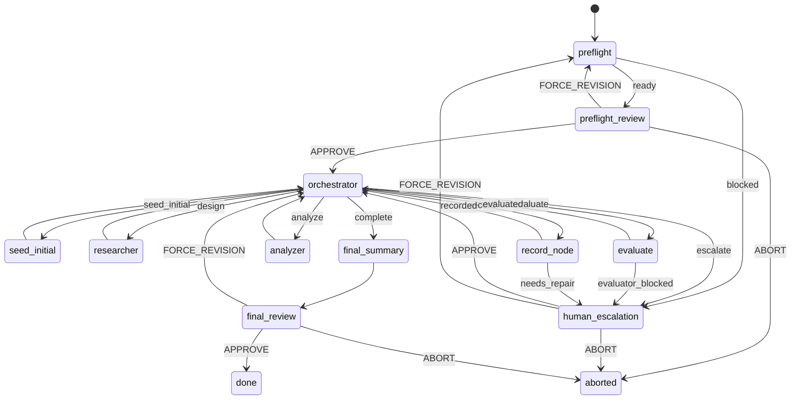

# ASI-Evolve Native Workflow Design

> **Review status (2026-06-15):** A ground-truth review against the IronCurtain
> workflow runtime and the standalone ASI-Evolve repo is recorded in
> [`asi-evolve-native-workflow-review.md`](./asi-evolve-native-workflow-review.md).
> The mechanical "must-fix" corrections from that review (artifact/bridge model,
> human-gate event names, `unversionedArtifacts` granularity, the `eval()`
> remediation status, and the `vuln-discovery` comparison) have been folded into
> the text below.
>
> **Revision (2026-06-15):** Following that review, v1 was redirected to run the
> evaluator and node-recording in **deterministic states that `exec` into the
> workflow's shared container** rather than in agent states. This requires three
> pieces of new, general workflow-runtime work — containerized deterministic
> execution, a structured deterministic result contract, and a convention for
> packaging a workflow's helper scripts and dependencies into the container — all
> described below. The change is deliberate: it dissolves the
> agent-shells-out-to-wrappers tension and the `record_node`-atomicity
> contradiction the review raised, at the cost of building those three runtime
> capabilities. Containment is **container-level** (`--network=none`, workspace
> mount), not ToolCallCoordinator-mediated, which is an accepted trade-off.

## Purpose

This document proposes converting `donotcommit/ASI-Evolve` from a standalone Python
evolution pipeline into a native IronCurtain workflow under
`src/workflow/workflows/`. The target is an IronCurtain FSM that preserves
ASI-Evolve's evaluator-driven program-search loop while using IronCurtain's
existing workflow primitives: YAML/XState definitions, agent and deterministic
states, human gates, `.workflow/` artifacts, checkpoint/resume, shared container
mode, policy hot-swapping, message logs, and web UI workflow monitoring.

ASI-Evolve's current loop is:

```text
sample prior experiment nodes + retrieve cognition
  -> researcher proposes candidate code
  -> engineer materializes code and runs evaluator
  -> analyzer summarizes outcome
  -> database records node, lineage, score, best snapshot
  -> repeat
```

The proposed native workflow should keep that loop recognizable, but it should
move orchestration ownership from `donotcommit/ASI-Evolve/pipeline/main.py` into
IronCurtain's workflow runtime.

## Goals

- Provide a first-class `asi-evolve` workflow definition that can be started,
  monitored, paused, resumed, and reviewed through the IronCurtain workflow UI.
- Preserve the conceptual ASI-Evolve roles: Researcher, Engineer, Analyzer,
  experiment database, cognition store, sampling strategy, evaluator execution,
  lineage tracking, and best-candidate snapshotting.
- Store workflow-visible state under workspace `.workflow/` instead of
  ASI-Evolve's repository-local `experiments/<name>/` directory.
- Use agent states for semantic work (orchestrator routing, researcher,
  analyzer, summaries). The workflow host should not decide the search strategy
  in normal operation; it should validate the agent's formatted status block and
  follow the declared edge.
- Use deterministic states for mechanical, untrusted, or transactional work
  (evaluator execution, durable node recording, run-spec normalization). These
  states `exec` into the workflow's shared container — building that
  containerized deterministic execution path is part of this work, not a
  prerequisite assumed to already exist.
- Make evaluator execution container-isolated and auditable by running it from a
  deterministic state that `exec`s into the shared container (`--network=none`),
  capturing exit code, stdout, stderr, timeout status, and score. Containment is
  the container boundary, not ToolCallCoordinator policy mediation.
- Support checkpoint/resume without depending on the standalone
  `pipeline_state.json` format.
- Leave a concrete migration path from the existing standalone framework and the
  `skills/evolve` single-agent abstraction.

## Non-Goals

- Do not run or wrap `python donotcommit/ASI-Evolve/main.py` as the workflow
  implementation. That would preserve the old orchestrator inside a new shell.
- Do not require feature parity with ASI-Evolve parallel worker mode in the first
  native workflow.
- Do not solve arbitrary evaluator sandboxing beyond IronCurtain's existing
  policy/container controls and the workflow-specific restrictions proposed here.
- Do not make cognition a global cross-run memory system by default.
- Do not replace IronCurtain's workflow checkpoints with ASI-Evolve's
  `pipeline_state.json`.
- Do not make deterministic states the primary search controller. They run the
  evaluator, durable writes, and mechanical checks, but ASI-Evolve's next-step
  choice belongs in the `orchestrator` agent's status block, following the same
  pattern as `vuln-discovery`.
- Do not run candidate or helper code on the host. All evaluator and helper
  execution happens inside the shared container; host-side `execFile` is not used
  for any untrusted or domain-mutating command.

## Implementation Status

> **Status as of 2026-06-17.** The full v1 roadmap — the three runtime capabilities,
> the orchestrator-hub FSM, **all four human gates** (`preflight_review` /
> `human_escalation` / `final_summary` / `final_review`), the `aborted` terminal, and
> a **generic experiment harness** that runs any ASI-Evolve-layout experiment via
> `--workspace` with zero per-experiment edits — has shipped across six merged PRs
> (#292, #299, #300, #302, #303, #309), all verified against `master`. The design is
> substantially implemented; the genuine remainders are resume-safety / record-by-
> step-id idempotency (#7), the `.evolve_runs/`→`.workflow/` flatten + UI summary
> artifacts (#4→#9), and `seed_initial`. This section is the index; each
> roadmap-bearing section below carries an inline `**[DONE — #NNN]**` /
> `**[PARTIAL — #NNN]**` / `**[PENDING]**` marker next to the specific item, with
> a one-line note where the shipped reality diverges from the original sketch.

| Milestone (Migration Plan #)                   | Status  | PR / commit                                          | Note                                                                                                                                                                                                                                                                                                                                                                                                                                                                                                                                                                         |
| ---------------------------------------------- | ------- | ---------------------------------------------------- | ---------------------------------------------------------------------------------------------------------------------------------------------------------------------------------------------------------------------------------------------------------------------------------------------------------------------------------------------------------------------------------------------------------------------------------------------------------------------------------------------------------------------------------------------------------------------------- |
| Containerized deterministic execution (#1)     | DONE    | #292 / `9602675`                                     | `container: true` + `containerScope`; runs `run:` array via `DockerManager.exec` in the scope's bundle; WF011 lint guards ordering                                                                                                                                                                                                                                                                                                                                                                                                                                           |
| Structured deterministic result contract (#2)  | DONE    | #299 / `b3f4bf0`                                     | `resultFile` + `when: { verdict }` routing; `{ verdict, payload?, passed? }`; reserved `result_file_error`; symlink-safe host-side read; WF012 lint                                                                                                                                                                                                                                                                                                                                                                                                                          |
| Workflow script packaging (#3)                 | DONE    | #292 / `9602675` (deps: #308 / #309)                 | `scripts/` staged read-only at `/workflow-scripts` for the whole run. **Dependency provisioning changed after design:** #308 replaced the baked per-workflow image with **runtime install through the MITM proxy**, and #309's `provision` agent state installs each experiment's `requirements.txt` at run time (see "Getting the dependencies into the container")                                                                                                                                                                                                         |
| `.workflow/` schema + declared outputs (#4)    | PARTIAL | #300 / `8fd85cd`                                     | **Deviation:** ships on the engine-native `.evolve_runs/main/` layout (hard-coded in `run_state.py`), NOT the flattened `.workflow/database/...` sketched here. No subtrees are declared as outputs yet; flattening + UI-declared artifacts are deferred (→ #9)                                                                                                                                                                                                                                                                                                              |
| Package the `evolve` engine (#5)               | DONE    | #300 / `8fd85cd`                                     | `evolve_core` vendored **byte-verbatim** under `scripts/` (Apache-2.0 + README) + CLI wrappers; the `evolve_result.py` bridge translates engine JSON → result contract. The standalone `pipeline/` orchestrator is not ported                                                                                                                                                                                                                                                                                                                                                |
| Build the FSM, incl. all human gates (#6)      | DONE    | #300 → #302 → #303 / `8fd85cd`, `e066898`, `25e115a` | Orchestrator-hub FSM looping with the **full** human surface: all four gates (`preflight_review`, `human_escalation`, `final_review` + the harness-added `provision_review`), the `final_summary` agent state, and the `aborted` terminal all ship in `src/workflow/workflows/evolve/workflow.yaml`. `complete → final_summary → final_review → done`; `escalate`/hard-failures → `human_escalation`; the `failed` terminal is retained behind the `isRoundLimitReached` wedge backstop. Only `seed_initial` remains deferred (round 1 samples an empty DB → `parent: null`) |
| Durable-write / transaction helpers (#7)       | PARTIAL | #300 → #302 / `8fd85cd`, `e066898`                   | The vendored `run_state.py` / `file_lock.py` layer ships and `analysis_record` is the single durable engine write per round. The full transaction-log protocol in "Run State Persistence" is **not** implemented; resume-safety + record-by-step-id idempotency are deferred                                                                                                                                                                                                                                                                                                 |
| Migrate one demo to a single-file fixture (#8) | DONE    | #309 / `58233f1`                                     | The **generic experiment harness** supersedes the per-demo migration: any ASI-Evolve-layout experiment runs by pointing the existing `--workspace <dir>` at it (new `provision` agent state, generic `preflight` inference, no per-experiment `workflow.yaml`/`scripts/` edits). Validated live — the **circle-packing** demo reached `done` via `--workspace` (score 0.96 → 2.62, zero evaluator-timeout truncations after the bridge timeout fix). CI fixtures remain the tiny in-test `solve(xs)→6` for speed                                                             |
| UI summary artifacts (#9)                      | PENDING | —                                                    | No declared summary artifacts / round table; surfacing is still blocked on the `.evolve_runs/` vs `.workflow/` decision (#4)                                                                                                                                                                                                                                                                                                                                                                                                                                                 |

**Determinism fixes (not a numbered milestone but load-bearing):** `PYTHONHASHSEED=0`
is pinned in the **bridge subprocess env** (`evolve_result.py`), not by patching the
vendored engine; `created_at` is normalized at comparison time. Both shipped in
**#302 / `e066898`**. This is the recurring shape of the shipped work: corrections
live in the IronCurtain-authored bridge, the vendored engine stays byte-verbatim.

**Slice delivery — all four slices merged.** The FSM/engine work landed as four
vertical slices, each with its own detailed spec and real-Docker gate (consult those
for the exact shipped `workflow.yaml`, bridge argv, and gate assertions):

- [`evolve-single-round-slice.md`](./evolve-single-round-slice.md) — #300, the linear
  single round.
- [`evolve-multi-round-slice.md`](./evolve-multi-round-slice.md) — #302, the
  orchestrator-hub loop, analyzer, and cognition.
- [`evolve-human-surface-slice.md`](./evolve-human-surface-slice.md) — #303, the four
  human gates (`preflight_review` / `human_escalation` / `final_review`), the
  `final_summary` agent state, and the `aborted` terminal. **Merged**, not pending.
- [`evolve-experiment-harness-slice.md`](./evolve-experiment-harness-slice.md) — #309,
  the generic harness: a `provision` agent state, reuse of the existing `--workspace`
  flag as the experiment-dir source, generic `preflight` inference, the bridge
  evaluator-timeout fix, seed-aware max-rounds, and a task-derived success criterion.
  **Merged**, validated live on the circle-packing demo.

The genuine remaining work is no longer a slice that is "designed and ready to
implement" — it is the residual items called out in the table above: resume-safety +
record-by-step-id idempotency (#7), the `.evolve_runs/`→`.workflow/` flatten + UI
summary artifacts (#4→#9), and the deferred `seed_initial` baseline-seeding state.

## Current Workflow Semantics

The design must account for these canonical current IronCurtain behaviors:

- Agent states run through workflow sessions. In Docker/shared-container mode
  they use the workspace, persona policy, tool coordinator, message log, and
  human-gate surface described in `WORKFLOWS.md`.
- Agent states choose their next transition by emitting a final fenced
  `agent_status` YAML block. For a state whose transitions are _all_
  verdict-conditional, the workflow prompt builder injects the valid verdict
  values derived from those transitions, the host parses and validates the
  block, and XState follows the first matching `when` edge; an invalid verdict
  is re-prompted. A state with any unconditional edge (a bare `to: <state>`
  return, as several `vuln-discovery` specialists use) gets no injected verdict
  list and no verdict validation — its `agent_status` block is informational
  only. This is the normal steering path, not an exceptional path.
- Deterministic states are command arrays (`run: [[binary, ...args]]`). The
  current orchestrator executes them with host-side `execFile`, not inside the
  workflow container or through the tool coordinator.
- Deterministic results currently reduce to `passed`, optional `testCount`, and
  `errors`. Machine routing for deterministic states uses registered guards;
  it does not parse arbitrary domain verdicts such as `continue`, `valid`, or
  `evaluator_blocked` from stdout or artifacts.
- `settings.sharedContainer` and policy hot-swapping apply to agent sessions.
  They do not by themselves constrain host-side deterministic commands.
- Workspace `.workflow/...` files are agent-visible project artifacts and they
  _are_ the orchestrator's logical artifacts: the artifact directory resolves to
  `<workspace>/.workflow` (`WORKFLOW_ARTIFACT_DIR`), so a state's `inputs`,
  `outputs`, and human-gate `present` names map directly to `.workflow/<name>/`
  subdirectories. There is no second artifact store to bridge to. `.vN`
  versioning (suppressible via `settings.unversionedArtifacts`) applies to
  declared top-level output names, not to arbitrary nested paths; undeclared
  workspace paths are simply never snapshotted.

The bullets above describe the runtime **as it existed at design time**. Two of
them — host-side deterministic execution and the pass/fail-only deterministic
result — are exactly what this design changed: see "Runtime Capabilities," which
moves deterministic execution into the shared container and adds a structured
result contract. **Both have shipped** (`**[DONE — #292, #299]**`): a deterministic
state with `container: true` now runs its `run:` array via `DockerManager.exec`,
and deterministic states route on `when: { verdict }` from a helper-written
`resultFile`. The two bullets above are therefore now superseded for
`container: true` states; host-side `execFile` + pass/fail guards remain the
default only for ordinary (non-container) deterministic states. The steering model
is otherwise unchanged: the `orchestrator` agent owns search strategy, and
deterministic states run the evaluator, durable writes, and mechanical checks under
that orchestration.

## Runtime Capabilities: New Work in v1

v1 is **not** buildable purely as workflow YAML on today's runtime. It needs two
pieces of new, general-purpose **runtime** work (items 1 and 2 below) plus one
piece of **engine** work that is mostly already written (item 3). The two runtime
pieces are general-purpose because they change the deterministic-state machinery
for _all_ workflows (vuln-discovery, design-and-code), not only ASI-Evolve — so
each deserves its own tests, lint, and a security note. Both are small in code but
carry real design decisions.

The relevant fact is the split between the two state kinds. **Agent states** run
an LLM in a session inside the workflow's shared Docker container, with verdict-
based routing. **Deterministic states** today run a host-side command array via
`execFileAsync` with no container, no timeout, and no process-tree cleanup; they
route only through a pass/fail guard on a `{ passed, testCount, errors }` result
(`orchestrator.ts:2253-2279`). This design moves the evaluator and node-recording
into deterministic states, so those two limitations must be lifted.

**1. Containerized deterministic execution.** `**[DONE — #292]**` Shipped as the
opt-in `container: true` + `containerScope` flags on deterministic states; the
state's `run:` array executes via `DockerManager.exec` against the scope's bundle,
guarded by the WF011 lint (a container state must be reachable only behind a
same-scope agent that mints the container) and validation (`container: true`
requires `sharedContainer` + `mode: docker`). A deterministic state should be
able to run its command array _inside the workflow's shared container_ instead of
host-side. The plumbing already exists: `DockerManager.exec(containerId, command,
timeoutMs)` returns `{ exitCode, stdout, stderr }` with a timeout
(`docker-manager.ts:242-285`) and is already how agent sessions drive the
container (`docker-agent-session.ts:290`); the orchestrator already holds the
running bundle per scope (`instance.bundlesByScope`, `orchestrator.ts:565`). The
container already runs `--network=none` with `--init`/tini reaping zombies and
the workspace bind-mounted, so an `exec`'d command inherits network isolation,
workspace access, and cleanup for free. The work is: thread the workflow id /
container scope into the deterministic execution path so it can find the bundle,
and decide the lifecycle rule (simplest: a container-exec deterministic state
requires its scope's container to already exist, which holds here because the
`orchestrator` agent always runs first).

**2. A structured deterministic result contract.** `**[DONE — #299]**` Shipped:
a `container: true` deterministic state declares a `resultFile`, a helper writes
`{ verdict, payload?, passed? }` to it, and the machine routes on
`when: { verdict: ... }` via the existing `__matchesWhen` guard. The reserved
`result_file_error` verdict covers a missing/malformed file, and the host-side read
is symlink-safe (`isWithinDirectory` containment, split read/parse errors). This is
exactly what lets `evaluate`/`record_node` route mechanical outcomes. A
deterministic state should be able to emit a structured verdict plus a
machine-readable payload, not only `passed`/`testCount`/`errors`, and the
machine-builder should route deterministic states on `when: { verdict: ... }` edges
the same way it routes agent states.
The verdict is sourced from a result file the helper writes (e.g.
`evaluation.json`, `record_result.json`) — the orchestrator reads it and routes.
This is what lets a deterministic `evaluate` distinguish `evaluated` from
`evaluator_blocked`, and a deterministic `record_node` distinguish `recorded`
from `needs_repair`, so hard mechanical failures route straight to
`human_escalation` without spending an orchestrator-agent turn. (Today
deterministic transitions accept only `guard:`, not `when:`.)

**3. Durable, idempotent domain-state writes** for run state, current-step state,
nodes, sampler state, indexes, step artifacts, and best snapshots.
`**[PARTIAL — #300, #302]**` The vendored `run_state.py` / `file_lock.py` layer
ships and is exercised: `analysis_record` is the **single** durable engine
node-write per round (`evolve-db record --analysis-file --parent`), which keeps the
node count exactly N. **What remains:** the full transaction-log protocol below
(`transactions/<txn_id>.json`, hash-checked inputs, index/version pairing) is _not_
implemented, and `evolve-db record` is **not** idempotent by step name (every call
allocates a fresh id), so crash-then-resume double-commit is currently avoided by
graph construction (one record call, after analysis), not by an idempotency key —
record-by-step-id is explicitly deferred. IronCurtain
checkpoints snapshot FSM/control state, not domain mutations (`types.ts:532-558`),
so crash-safe domain writes are the workflow engine's responsibility, not the
runtime's. This is mostly **already built**: the vendored `evolve_core` ships
`run_state.py` (run-layout, round-log append, path-allowlisting, the
`require_evolve_ready` approval gate) and `file_lock.py`, so the task is to
verify/extend that layer, not write it from scratch. With `record_node` now a
deterministic state running a real helper process with a real exit code, the
protocol is also finally _enforceable_ — atomicity lives in the helper, not in an
LLM's judgment. How elaborate it must be is an open question; the full
transactional scheme in "Run State Persistence" may be more than a single-file,
single-worker v1 needs.

These three are paired: container execution without the structured result
contract would force `record_node` back through the orchestrator agent for every
outcome; the result contract without container execution would be unsafe for the
evaluator. Building both is what lets `evaluate` and `record_node` become
deterministic.

There is no artifact "bridge" gap. The artifact directory already _is_ the
domain store (`.workflow/`), so surfacing a subtree to gates, prompts, UI, or
`.vN` versioning is just declaring it as a state `output` — a naming convention,
not a missing runtime feature. See "Artifact Layout." **[Shipped reality — #300]:**
the shipped workflow writes its domain store under the engine-native
`.evolve_runs/main/` layout (hard-coded by `run_state.py`), _not_ under
`.workflow/`, so nothing is currently declared as an output and the "just declare
it" surfacing is deferred until the layout is flattened or shimmed. Packaging the
Python helpers and their dependencies into the container is a fourth piece of new
work, covered in "Packaging Helper Scripts and Dependencies" `**[DONE — #292]**`
(see that section for the shipped staging/image mechanism).

## V1 Strategy

> `**[DONE — #300, #302, #303, #309]**` **Shipped reality:** the v1 split below is built and
> looping, with two deltas. (a) The orchestrator was implemented as a true
> **agent hub** (the "Proposed FSM" shape), not a thin controller — the loop is
> driven by the orchestrator's `design`/`evaluate`/`analyze`/`record`/`complete`
> verdicts with every specialist returning to it. (b) `record_node` as a separate
> durable write was **folded into a single `analysis_record` deterministic state**
> per round (the engine's `record` is not step-idempotent, so the round records
> exactly once, after analysis). `final_summary` now ships (#303). A `sample`
> deterministic state was also added ahead of `researcher` to do the durable
> parent/cognition read, and a `provision` agent state (#309) fronts the FSM.

The v1 workflow is a native IronCurtain FSM with a clean split between semantic
agent states and mechanical/transactional deterministic states:

- A controller/`orchestrator` agent owns search strategy and emits routing
  verdicts.
- `researcher`, `analyzer`, and `final_summary` are agent states that perform
  their scoped semantic work and emit formatted `agent_status` verdicts.
  (All three ship; `final_summary` landed in #303.)
- `evaluate` and `record_node` are **deterministic** states that `exec` packaged
  helpers inside the shared container, capture exit code / stdout / stderr, and
  emit a structured result verdict the machine routes on. The evaluator never
  runs on the host and is never driven by an LLM. (Shipped: `evaluate` plus a
  `sample` and an `analysis_record` deterministic state; `record_node` collapsed
  into `analysis_record`.)
- Other deterministic states may perform mechanical checks (run-spec
  normalization, candidate manifest validation, summary generation). They do not
  decide the next research direction.
- The `skills/evolve` Python wrappers provide the durable database, cognition,
  sampling, evaluation, and summary operations — but they are invoked by
  deterministic states via `docker exec`, not driven by an agent through a shell.
  The FSM supplies state boundaries, prompts, gates, container isolation,
  auditability, and UI visibility.

This is still a native IronCurtain workflow: the FSM is explicit, transitions
are verdict-based, checkpoints and gates are handled by the workflow runtime,
and state handoffs use `.workflow/` artifacts. It is not just `python main.py`
wrapped in a shell.

The v1 candidate scope is **single-file**: each node materializes one complete
candidate file at `steps/<step_id>/code`. `**[DONE — #300, #302]**` Shipped as
designed (full-file emit; diff-apply deferred). Multi-file evolution is a later
data model extension requiring candidate manifests, per-file hashes, diff storage,
restore behavior, and best-snapshot semantics.

## Current ASI-Evolve Model

The standalone pipeline in `donotcommit/ASI-Evolve/pipeline/main.py` coordinates
these services:

- Configuration loading from repo defaults, experiment config, and explicit
  config file.
- Experiment directory creation under
  `donotcommit/ASI-Evolve/experiments/<experiment_name>/`.
- Database initialization under `database_data/`, backed by JSON, embeddings,
  FAISS, and a sampler.
- Cognition initialization under `cognition_data/`, backed by JSON, embeddings,
  and FAISS.
- Optional manager-generated prompts.
- Optional initial program evaluation as node 0.
- Repeated steps that sample context nodes, retrieve cognition, ask Researcher
  for a candidate, run Engineer's evaluator, ask Analyzer for a lesson, record a
  `Node`, and update the best snapshot.

The stored `Node` schema includes `id`, `name`, `created_at`, `parent`,
`motivation`, `code`, `results`, `analysis`, `meta_info`, `visit_count`, and
`score`. Sampling algorithms include `random`, `greedy`, `ucb1`, and `island`.
The Engineer writes a step-local `code` file, runs `bash <eval_script>` with a
timeout, parses `results.json` or `results.txt`, requires `eval_score` for
structured evaluation, and computes final score with an optional LLM judge.

The existing `skills/evolve` abstraction already points toward the desired
native shape: explicit preflight, fixed sampling configuration, a durable run
spec, deterministic helper scripts, and a single run directory. The native
workflow should reuse these ideas, but move the loop into IronCurtain FSM states
instead of relying on an agent to manually drive wrapper commands.

## Concept Mapping

| ASI-Evolve concept              | Native IronCurtain concept                                                                           |
| ------------------------------- | ---------------------------------------------------------------------------------------------------- |
| Pipeline loop                   | Agent-driven FSM cycle with explicit verdict transitions                                             |
| Researcher                      | `researcher` agent state                                                                             |
| Engineer materialization/eval   | `evaluate` deterministic state — `exec`s the packaged evaluator helper in the shared container       |
| Analyzer                        | `analyzer` agent state                                                                               |
| Manager                         | Optional `prompt_designer` agent state, disabled by default                                          |
| Experiment config               | `.workflow/run_spec.yaml` plus workflow task description                                             |
| `experiments/<name>/steps`      | `.workflow/steps/<step_id>/`                                                                         |
| `database_data/nodes.json`      | `.workflow/database/nodes.json`                                                                      |
| FAISS index                     | `.workflow/database/index/` or deterministic helper-managed vector index                             |
| `cognition_data/cognition.json` | `.workflow/cognition/cognition.json`                                                                 |
| `pipeline_state.json`           | IronCurtain checkpoints plus transactional `.workflow/run_state.json` / `transactions/` domain state |
| `BestSnapshotManager`           | `record_node` deterministic state runs the transactional record helper; updates `.workflow/best/`    |
| `eval.sh`                       | run-spec evaluator command `exec`'d in the shared container by the `evaluate` deterministic state    |
| Step lock / parallel workers    | non-goal for v1; possible future deterministic queue                                                 |
| Skill preflight approval        | `preflight_review` human gate                                                                        |

## Proposed FSM

> `**[DONE — #302, #303, #309]**` **Shipped FSM (`src/workflow/workflows/evolve/workflow.yaml`).**
> The orchestrator-hub shape below is built, looping, and now carries the **full
> human surface**: all four gates (`preflight_review`, `human_escalation`,
> `final_review`, plus the harness-added `provision_review`), the `final_summary`
> agent state, and the `aborted` terminal all ship (#303). `complete →
final_summary → final_review → done`; the orchestrator's `escalate` and every
> deterministic hard-failure (`evaluator_blocked`, `sample_error`, `needs_repair`,
> `result_file_error`) route to `human_escalation`. The `failed` terminal is
> **retained** but now only as the wedge backstop behind the
> `isRoundLimitReached` guard, not as the stand-in for human escalation. The
> harness slice (#309) made `provision` the new `initial:` state, ahead of
> `preflight`. Remaining diagram differences, all deliberate: `seed_initial` is
> still collapsed (round 1 just samples an empty DB → `parent: null`); a `sample`
> deterministic state (greedy parent + cognition retrieval) precedes `researcher`,
> and the single durable node-write is `analysis_record` (the diagram's
> `record_node`, renamed and made the one-write-per-round state). The
> `settings.maxRounds` + `isRoundLimitReached` guard is the terminal-safety
> backstop for a wedged hub; the real round budget lives in `run_spec.yaml`.

The workflow should follow the same agent-driven, verdict-routed model as
`vuln-discovery`, with an `orchestrator` hub at its center. An `orchestrator`
agent maintains the ASI-Evolve journal / run state, reads the durable database
summaries, and decides which specialist state to dispatch next by emitting one
of the allowed verdicts. The workflow host validates that verdict and follows
the declared transition; it does not choose the search strategy except for guard
failures, malformed outputs, human gate events, and terminal cleanup.

The hub-and-spoke shape below is _cleaner_ than `vuln-discovery`'s actual graph
and is not inherited wholesale: `vuln-discovery`'s entry state is `orchestrator`
(it has no `preflight`/`preflight_review` gate), and several of its spokes are
multi-state chains whose intermediate states do not return to the hub
(`harness_design -> harness_design_review -> harness_build -> harness_validate`;
`conclude -> review -> report_review`). The `preflight` gate and the strict
"every specialist returns to `orchestrator`" rule are net-new design choices
here, not precedents copied from `vuln-discovery`.



Human-gate edge labels above use the YAML `event:` names an author writes in a
workflow definition (`APPROVE`, `FORCE_REVISION`, `ABORT`; the runtime also
supports `REPLAN`). The `HUMAN_*`-prefixed forms are the _internal_ XState event
names the machine builder derives from these; do not use them in workflow YAML.

`evaluate` and `record_node` are **deterministic** states; every other
non-terminal, non-gate state is an agent state. Their edge labels (`evaluated`,
`evaluator_blocked`, `recorded`, `needs_repair`) are values from the structured
deterministic result contract — the machine routes them via `when: { verdict: ...
}` edges, sending the happy path back to `orchestrator` and hard mechanical
failures straight to `human_escalation` without spending an orchestrator turn.

### State Responsibilities

`preflight` (`agent`) `**[DONE — #300, #302, #309]**` (writes
`.evolve_runs/main/run_spec.yaml` not `.workflow/run_spec.yaml`; also authors
`cognition_seed.md`. Since #303 a real `preflight_review` gate flips approval; since
#309 the spec is **inferred generically** from the `--workspace` experiment dir —
objective / evaluator command / cognition seed / initial-program seed — with a
task-string fallback when the workspace is a fresh sandbox)
: Reads the task description and workspace. Produces
`.workflow/run_spec.yaml` and `.workflow/preflight_summary.md`.
It must specify objective, core score, secondary metrics, evaluator command or
script, timeout, success criteria, stop conditions, writable mutation scope,
single-file candidate path, sampling algorithm, cognition source mode, and
round budget. It must also keep a machine-readable
`approval.confirmed=false` field until explicit human approval.

`preflight_review` (`human_gate`) `**[DONE — #303]**` (ships in the graph; approval
is also still enforced at the helper layer via `require_evolve_ready`)
: Presents the run spec and summary. Approval is required before any candidate
mutation or evaluator execution. Approval must be reflected in domain state by
an orchestrator-controlled update that flips `approval.confirmed=true`; helpers
must reject mutating or evaluator commands while this flag is false.

`orchestrator` (`agent`) `**[DONE — #302]**` (built as the agent hub; reads
`run_spec.yaml` + `database_data/nodes.json` to derive `done_rounds` vs
`max_rounds`; emits `design`/`evaluate`/`analyze`/`record`/`complete`/`escalate`)
: The central router. It reads `.workflow/run_state.json`,
`round_log.jsonl`, database summaries, best-node metadata, and the prior
state's output. It chooses the next state by emitting a verdict such as
`seed_initial`, `design`, `evaluate`, `analyze`, `record`, `complete`, or
`escalate`. It also writes a concise directive for the next specialist state,
mirroring `vuln-discovery`'s "Directive for next agent" pattern.

`seed_initial` (`agent`) `**[PENDING — deferred]**` (collapsed: round 1 samples an
empty DB → `parent: null`, and the normal `researcher` writes the first candidate;
no separate baseline-seeding state ships)
: If an initial candidate exists, materializes it into
`steps/step_0000_initial/code` and returns to `orchestrator`, which then
dispatches the normal deterministic `evaluate` and `record_node` states for it —
the baseline node uses the exact same evaluator and recording path as later
candidates. If no initial candidate exists, it records an empty database and
continues. It may be split into `seed_initial` and `analyze_initial` if the
baseline node should receive an LLM analysis in v1.

`sample` (`deterministic`, runs in the shared container) `**[DONE — #302]**` (new
state, not in the original responsibilities list; precedes `researcher`)
: The round's single "read durable state" boundary. Runs `evolve-db sample`
(greedy parent) **and** `evolve-cognition search` (vector retrieval), seeds
cognition on first entry, allocates the per-round `step_name`, and merges
everything into `current/context.json`. Emits `sampled` (→ `researcher`) or a
hard-failure verdict (→ `failed`).

`researcher` (`agent`) `**[DONE — #302]**` (sampling/cognition were moved out to the
deterministic `sample` state; `researcher` reads `current/context.json` and emits a
full candidate file; diff-apply deferred)
: Reads the orchestrator directive, run spec, sampled context, retrieved
cognition, and candidate parent code. Sampling and cognition retrieval can be
performed by durable evolve wrappers at the start of this state, with outputs
written to `.workflow/current/context.json` and
`.workflow/current/cognition.json`. The state writes candidate metadata
and code under the current step directory. The prompt should support diff and
full-rewrite modes, but final materialized code should always be emitted as a
complete candidate file. It returns to `orchestrator` after writing artifacts.

`evaluate` (`deterministic`, runs in the shared container) `**[DONE — #300, #302]**`
(per-round step/code resolved from `current/` via `--*-from-current` flags;
verdicts `evaluated`/`evaluator_blocked`/`result_file_error`)
: `exec`s the packaged evaluator helper inside the workflow's shared container.
The helper reads `steps/<step_id>/code`, runs the configured evaluator with the
configured timeout, captures stdout/stderr into `eval.stdout` / `eval.stderr`,
parses `results.json`, and writes normalized `evaluation.json` plus a result file
carrying the verdict. It preserves ASI-Evolve's required `eval_score` convention
unless the run spec names another scalar score field. Because it runs via
`docker exec` into a `--network=none` container, the evaluator is network-isolated
and its process tree is reaped by the container's `--init`; no LLM is in the loop.
It emits `evaluated` on success (→ `orchestrator`, which decides whether to
analyze, redesign, escalate, or stop) or `evaluator_blocked` on a missing score,
timeout, or malformed result (→ `human_escalation`).

`analyzer` (`agent`) `**[DONE — #302]**` (writes `current/analysis.md`; returns to
`orchestrator` unconditionally — its verdict is informational, not a routing
verdict; the lesson is persisted onto the node by `analysis_record`)
: Reads candidate code, normalized evaluator results, task description, and the
best sampled node. Writes `analysis.md` and a short structured verdict such as
`analyzed`, `retry_analysis`, or `escalate`. The next route still goes
through `orchestrator`; the analyzer's verdict is evidence for the
orchestrator, not direct host steering.

`record_node` (`deterministic`, runs in the shared container) `**[PARTIAL — #302,
shipped as `analysis_record`]**` (renamed `analysis_record`; the **single** durable
`evolve-db record --analysis-file --parent` per round; the full transaction
protocol below is not implemented, and `needs_repair` is detected from the helper
exit/verdict, not a transaction-log audit)
: `exec`s the transactional record helper, which creates the durable node record,
updates embeddings/vector index, updates sampler state, appends round-log entries,
and updates `.workflow/best/` when the node improves the best score. Atomicity is
the helper's responsibility and is now achievable because the state is a real
process with a real exit code, not an LLM driving wrappers — it implements the
transactional protocol in "Run State Persistence"; generic workflow checkpointing
is not enough for this state. It emits `recorded` on a clean commit
(→ `orchestrator`) or `needs_repair` when it detects a partial or inconsistent
prior commit (→ `human_escalation`).

`human_escalation` (`human_gate`) `**[DONE — #303]**` (ships in the graph; the
orchestrator's `escalate` and every deterministic hard-failure now route here. The
`failed` terminal is retained only as the `isRoundLimitReached` wedge backstop)
: Used for evaluator failures, ambiguous evaluator contracts, repeated invalid
candidate generation, noisy metrics, exhausted mutation scope, or required
run-spec changes.

`final_summary` (`agent`) `**[DONE — #303]**` (ships; the orchestrator's `complete`
now routes here, then to `final_review`)
: Produces a human-readable experiment summary, best candidate report, lineage
notes, and recommended next steps.

`final_review` (`human_gate`) `**[DONE — #303]**`
: Lets the user accept the final summary or force additional rounds/revisions.

`done` and `aborted` (`terminal`) `**[DONE — #300, #303]**` (both ship; `aborted` is
the distinct human-abort terminal added with the human gates in #303. The separate
`failed` terminal is also retained as the `isRoundLimitReached` wedge backstop)
: End states.

## Transitions and Verdicts

> `**[DONE — #302]**` The two-verdict-source model below is implemented as
> described. Shipped verdict set: orchestrator emits
> `design`/`evaluate`/`analyze`/`record`/`complete`/`escalate` (no `seed_initial`);
> `sample` emits `sampled`/`sample_error`/`result_file_error`; `evaluate` emits
> `evaluated`/`evaluator_blocked`/`result_file_error`; `analysis_record` emits
> `recorded`/`needs_repair`/`result_file_error`; `researcher`/`analyzer` return
> unconditionally (informational verdict). Human-gate events (`APPROVE` /
> `FORCE_REVISION` / `ABORT`) are now live and exercised at all four gates
> (`provision_review`, `preflight_review`, `human_escalation`, `final_review`)
> since #303 / #309.

The workflow uses two verdict sources. **Agent states** emit a fenced
`agent_status` YAML block: each agent prompt receives the valid verdict values
for that state, and the host validates the verdict and follows the matching
`when` transition. **Deterministic states** (`evaluate`, `record_node`) emit
their verdict through the structured result contract — a result file the helper
writes — and the machine routes on `when: { verdict: ... }` the same way. Both
are validated against the state's declared transitions.

Proposed verdicts:

- `preflight` (agent): `ready`, `blocked`
- `orchestrator` (agent): `seed_initial`, `design`, `evaluate`, `analyze`,
  `record`, `complete`, `escalate`
- `seed_initial` (agent): informational verdict; unconditional return to
  orchestrator
- `researcher` (agent): informational verdict; unconditional return to
  orchestrator
- `evaluate` (deterministic result): `evaluated` → `orchestrator`,
  `evaluator_blocked` → `human_escalation`
- `analyzer` (agent): informational or `analyzed` / `retry_analysis` /
  `escalate`; return to orchestrator
- `record_node` (deterministic result): `recorded` → `orchestrator`,
  `needs_repair` → `human_escalation`
- Human gates: YAML `event: APPROVE`, `event: FORCE_REVISION`, `event: ABORT`
  (the runtime also supports `REPLAN`). `HUMAN_APPROVE` / `HUMAN_FORCE_REVISION`
  / `HUMAN_ABORT` are the _internal_ XState event names derived from these;
  workflow YAML must use the unprefixed form.

The orchestrator is the only state that routes among search _phases_. The
deterministic states route only on their own mechanical outcome — happy path back
to the orchestrator, hard failure to `human_escalation` — and never choose the
next research direction. Specialist verdicts and notes are inputs to the
orchestrator's next directive.

Loop caps should be explicit:

- `researcher.maxVisits` should guard repeated invalid candidate revisions.
- `analyzer.maxVisits` should guard repeated malformed analysis output.
- Global round budget should live in `run_spec.yaml` and be enforced by
  the orchestrator, not by relying only on workflow `settings.maxRounds`.

## Artifact Layout

The domain source of truth should live under workspace `.workflow/`
because it is visible to agents and survives across state visits in the shared
workspace:

```text
.workflow/
  run_spec.yaml
  run_state.json
  preflight_summary.md
  final_summary.md
  round_log.jsonl
  current/
    context.json
    cognition.json
    step_id
  cognition/
    cognition.json
    index/
  database/
    nodes.json
    index/
    sampler_state.json
  steps/
    step_0000_initial/
      code
      results.json
      evaluation.json
      eval.stdout
      eval.stderr
      analysis.md
      node.json
    step_0001/
      candidate.raw.md
      candidate.json
      code
      results.json
      evaluation.json
      eval.stdout
      eval.stderr
      analysis.md
      node.json
  best/
    code
    node.json
    results.json
    analysis.md
```

Everything lives directly under `.workflow/` — there is no intervening
namespace directory. This matters because `.workflow/` is itself the
orchestrator's artifact directory (`artifactDir = resolve(workspace,
'.workflow')`), so each top-level entry is _already_ addressable as a logical
artifact name. The domain store and the logical artifact namespace are the same
thing; there is nothing to bridge or copy between:

- A logical artifact name resolves directly to its top-level entry — `current`
  is `.workflow/current/`, `database` is `.workflow/database/`. Workflow state
  `inputs`, `outputs`, and human-gate `present` entries are just these names.
- An entry gains `.vN` versioning, gate `present` visibility, and UI links only
  once it is _declared_ as a state `output`. Undeclared entries are ordinary
  workspace files: agent-visible and persistent across state visits, but never
  snapshotted.
- `settings.unversionedArtifacts` suppresses `.vN` snapshotting only for
  declared output names. A nested path inside a declared name (e.g.
  `.workflow/database/index/`) is versioned or skipped as a unit with its
  top-level name, never individually.
- Declare only the small, stable entries as outputs for gates and the UI — the
  preflight run spec and summary, the current-step bundle (`current/`), the
  round log (`round_log.jsonl`), and the final report (`final_summary.md`).
  Leave the large mutable stores (`database/`, `cognition/index/`, `steps/`,
  `best/`) undeclared so they are not re-snapshotted every loop; surface them to
  the UI through the declared summaries and append-only logs rather than raw
  index directories.

The design preference is append-only `steps/`, durable database updates, and a
few small declared summaries for UI/gate presentation.

## Run State Persistence

IronCurtain checkpoints should remain the canonical control-flow resume
mechanism. `.workflow/run_state.json` should be the canonical
domain-state file for ASI-Evolve-specific counters, but it is not sufficient by
itself. The domain store needs a small transaction protocol because helper
commands can die between filesystem side effects while the workflow checkpoint
still points at a state boundary.

```json
{
  "schema_version": 1,
  "status": "running",
  "next_step": 1,
  "completed_steps": 0,
  "failed_steps": 0,
  "best_node_id": null,
  "patience_remaining": 10,
  "sampling_algorithm": "ucb1",
  "started_at": "...",
  "updated_at": "..."
}
```

`run_state.json` and sampler/database internals are updated through durable helper
commands run by the deterministic `record_node` (and `evaluate`) states via
`docker exec`, not by free-form text editing. Because these are real processes
with real exit codes, the helpers enforce schemas, hashes, and transaction
boundaries and signal `recorded` / `needs_repair` back to the machine through the
structured result contract.

Transactional protocol:

- Each round has a stable `step_id` allocated by the orchestrator state through
  the run-state helper before candidate generation. The allocation is recorded
  in `run_state.json` and `.workflow/current/step_id`.
- Each mutating helper opens a transaction file under
  `.workflow/transactions/<txn_id>.json` with `step_id`, operation,
  input hashes, expected output paths, and phase.
- Helpers write new data to temp files under the same directory as the target,
  `fsync` where practical, and promote with atomic rename.
- `nodes.json` is the commit index for recorded nodes. `steps/<step_id>/node.json`
  is not considered committed until the matching node appears in `nodes.json`
  with the same candidate and evaluation hashes.
- Sampler state and vector/lexical indexes are derived or transactionally
  paired with a `nodes_version`. On resume, if an index version does not match
  `nodes.json`, the helper must rebuild or mark the run blocked rather than
  continuing with biased state.
- Visit-count increments are committed as their own transaction before candidate
  generation. If the workflow dies after sampling but before evaluation, resume
  must either reuse the same sampled context for that `step_id` or roll back the
  visit increment from the transaction log.
- `best/` is derived from committed nodes. If `best/` is missing or has a stale
  source node hash, it must be rebuilt from `nodes.json`.
- Agent-writable files that durable helpers trust must be hash-checked
  against the current transaction inputs. Helpers must reject unexpected edits
  to run spec, candidate code, evaluation files, or analysis after their
  corresponding phase is committed.

Resume behavior:

- If IronCurtain resumes before `record_node`, the current step may be rerun.
  Helpers must treat step IDs as idempotency keys.
- `record_node` should be atomic from the perspective of `nodes.json`: it may
  prepare node, index, sampler, and best-snapshot updates separately, but resume
  must be able to detect and either complete or roll back any partial phase.
- If `evaluate` produced results but `record_node` did not run, resume should
  reuse the existing `evaluation.json` when the candidate hash matches.
- If candidate code changed after evaluation, evaluation must rerun.

## Cognition and Database Strategy

The native workflow should start with a file-backed implementation compatible
with the existing ASI-Evolve concepts, but not necessarily byte-compatible with
the standalone repo.

Database requirements:

- Preserve the `Node` fields currently used by ASI-Evolve.
- Store every candidate, including failed or low-scoring candidates.
- Track parent IDs and sampled context IDs.
- Track visit counts because UCB1 and island sampling rely on them.
- Store sampler-specific state outside the agent prompt path.
- For target compatibility, support the same named sampler families as
  ASI-Evolve: `random`, `greedy`, `ucb1`, and `island`.
- For minimum viable v1, pick one named sampler implementation and seed policy
  before implementation starts. If that implementation is not byte-compatible
  with ASI-Evolve's storage/sampler code, document native v1 as
  ASI-Evolve-inspired rather than ASI-Evolve-compatible.
- Treat `island` as optional for v1 unless its feature dimensions, bins,
  migrations, diversity heuristics, and safe state serialization are ported as
  a coherent unit.

Cognition requirements:

- Store reusable external or domain knowledge, not round-by-round results.
- Keep per-round lessons in the experiment database, not cognition.
- Seed from user-specified files or notes during preflight/init.
- Allow agents to propose new cognition items, but require helper-enforced
  normalization before insertion.

Embedding/index implementation:

> `**[PARTIAL — #300, #302]**` Shipped on **Tier 0**: `evolve_core` runs in the
> container on numpy + PyYAML with the hash-token embedding and brute-force pickle
> index (no FAISS / sentence-transformers). `greedy` is the only wired sampler
> (deterministic — `ucb1`/`random`/`island` are deferred behind a seeding story).
> Cognition is seeded at `preflight` (text) + embedded in-container on `sample`'s
> first entry, and retrieved each round. **Determinism caveat:** the Tier-0
> hash-token retrieval is reproducible only because `PYTHONHASHSEED=0` is pinned in
> the bridge subprocess (#302), and it is a lower-quality retrieval policy than
> FAISS — not silently equivalent. Tier 1 (FAISS) is deferred.

- The storage/sampler/index code is the packaged `evolve_core` Python, run in the
  container by deterministic states (see "Packaging Helper Scripts and
  Dependencies"). A TypeScript port is no longer required to "avoid Python deps" —
  the deps ship in the workflow image — though a port remains an option if the
  team prefers a single-language runtime.
- `evolve_core` already ships the local fallbacks: a pure-numpy hash-token
  embedding (`embedding.py`) and a brute-force pickle index (`vector_index.py`),
  both selected automatically when sentence-transformers / FAISS are absent. v1
  therefore runs on numpy alone (Tier 0) with no image-layer work. This fallback is
  a different, lower-quality retrieval policy and must be called out as such, not
  silently presented as equivalent to FAISS-backed ASI-Evolve.
- The full embedding stack (FAISS + sentence-transformers) is a Tier 1 image-layer
  upgrade baked at build time (no runtime network under `--network=none`); it
  raises retrieval quality but is not required for a functional v1.

## Evaluator Execution Model

> `**[DONE — #300, #302]**` The `evaluate` deterministic state runs the configured
> evaluator via `docker exec` into the `--network=none` shared container, captures
> stdout/stderr/exit code, normalizes results, and treats a missing scalar score as
> `evaluator_blocked`. **Open gap confirmed still open:** evaluator write-scoping to
> `steps/<step_id>/` is _not_ enforced — the whole `/workspace` is mounted RW. The
> optional LLM judge is not implemented (it would be a separate `judge_candidate`
> agent state if added).

The evaluator is the primary trust boundary. The run spec should define:

- `evaluation.command` or `evaluation.script_path`
- `evaluation.timeout_secs`
- `evaluation.core_score`
- `evaluation.secondary_metrics`
- `evaluation.success_criteria`
- expected candidate path placeholder, usually `{code_path}`
- expected results path placeholder, usually `{results_path}`

The v1 `evaluate` deterministic state should:

- Run evaluator commands inside the workflow's shared container via `docker exec`
  (`DockerManager.exec`), never host-side.
- Materialize candidate code at a known path in the step directory.
- Pass paths through placeholders instead of assuming ASI-Evolve's current
  `bash <eval_script>` convention.
- Capture stdout/stderr into files and the exit code into the result.
- Enforce an outer timeout via the `exec` timeout; the container's `--init`/tini
  reaps orphaned children, so a forking evaluator does not leak onto the host.
- Prefer evaluators that also accept the same timeout internally.
- Require structured metrics in `results.json` or normalize raw output into
  `evaluation.json`.
- Treat missing scalar score as evaluator failure (`evaluator_blocked`) unless the
  run spec explicitly defines a conversion.

Containment is the container boundary: `--network=none` denies egress and the
workspace mount scopes the filesystem. This is weaker than per-syscall policy in
one respect — a raw `exec`'d process is not mediated by the ToolCallCoordinator —
but for a sandboxed evaluator that is an accepted trade-off, and `--network=none`
is a harder egress boundary than a policy rule. The one thing the container does
_not_ give for free is write-scoping to the step directory: the whole workspace is
mounted read-write, so "evaluator writes only to `steps/<step_id>/`" remains a
separate gap (sub-mount, copy-in/out, or post-hoc hash check) — see "Security and
Policy Model."

The existing Engineer's optional LLM judge should not run inside the
evaluator helper. If retained, it should be modeled as a separate agent state,
such as `judge_candidate`, that writes a judge score and rationale which
`record_node` combines with `eval_score`.

## Packaging Helper Scripts and Dependencies

> `**[DONE — #292 (mechanism), #300 (consumer)]**` Script packaging shipped: a
> workflow's `scripts/` are staged read-only at `/workflow-scripts` for the whole
> run (not filtered per agent-state `skills:`), and a per-workflow image is baked
> from `requirements.txt` at build time with the build-hash extended to include the
> manifest. The `evolve` workflow ships **Tier 0** (`numpy` + `pyyaml`); deterministic
> states invoke `/opt/workflow-venv/bin/python /workflow-scripts/evolve_result.py ...`.
> Tier 1 (FAISS image layer) and Tier 2 (vendored wheels) remain as designed —
> deferred / avoided respectively.

The deterministic states `exec` Python helpers (the `evolve_core` engine and its
CLI wrappers) inside the shared container. Two things must therefore travel with
the workflow definition and reach the container: the **script code** and its
**dependencies**. They have very different difficulty.

### What is being packaged

The reuse target is the vendored `evolve_core` (`skills/evolve/scripts/evolve_core/`),
**~2,700 LOC** of Python already refactored into a CLI-driven, dependency-light
engine. It is not raw library code: `cli.py` exposes exactly the subcommands the
deterministic states call (`db sample/record/best/stats`, `cognition
init/add/search`, `eval run/inspect`, `files read/write/diff`, `summary final`,
`brief normalize`), and it already ships the run-state/transaction layer
(`run_state.py`, `file_lock.py`), all four samplers (with the `ast.literal_eval`
fix already in place), and storage/cognition/diff/best-snapshot. This is why the
recommendation is to **package** the engine rather than re-implement it in
TypeScript — a port would re-derive ~2,700 LOC of working, tested code (including
the island MAP-Elites sampler and numpy vector math) for the sole benefit of a
single-language runtime, and remains an optional later cleanup, not a v1
requirement.

Crucially, `evolve_core` imports **only stdlib + numpy** by default. Its two heavy
deps are already optional with implemented fallbacks: `embedding.py` falls back
from sentence-transformers to a pure-numpy hash-token embedding, and
`vector_index.py` falls back from FAISS to a brute-force pickle index. So the
numpy-only configuration is fully functional, not a degraded stub — see the
dependency tiers below.

### Workflow package layout

A workflow already lives at `src/workflow/workflows/<name>/` (or
`~/.ironcurtain/workflows/<name>/`) with `workflow.yaml` and an optional `skills/`
subdirectory (`workflow/discovery.ts`). v1 adds a first-class `scripts/` directory
and a dependency manifest alongside them:

```text
src/workflow/workflows/asi-evolve/
  workflow.yaml
  skills/
    evolve/...            # prompts, references (de-sequenced — see skill rules)
  scripts/
    evolve_core/...       # the packaged Python engine
    evolve-eval           # CLI wrappers invoked by deterministic states
    evolve-db
    evolve-cognition
    evolve-summary
  requirements.txt        # Python deps to bake into the workflow image (Tier 1)
```

### Getting the code into the container (easy)

The skill-staging machinery already copies a per-workflow directory into a
per-bundle host dir and bind-mounts it read-only into the container, re-staging on
every state transition (`docker-infrastructure.ts:636-658`). v1 reuses that
mechanism for `scripts/`, with one change: a workflow's `scripts/` must be staged
**unconditionally for the whole run**, not filtered per agent-state `skills:`
list, because deterministic states have no `skills:` field and must still find the
helpers. Concretely, mount `scripts/` at a stable read-only path (e.g.
`/opt/ironcurtain/workflow-scripts/`) for the container's lifetime; deterministic
states then invoke `docker exec python
/opt/ironcurtain/workflow-scripts/evolve-eval <args>`. No runtime network is
needed — the code is already on disk in the container.

### Getting the dependencies into the container (the hard part)

> **[SUPERSEDED — #308 / #309].** The build-time premise below turned out to be
> wrong. The workflow container reaches the network through the host **MITM proxy**
> (`HTTPS_PROXY`/`HTTP_PROXY` are wired into the container env, and the proxy
> allowlist already models package **registries**), so `pip`/`uv`/`apt` _can_ run
> during the workflow despite `--network=none`. PR **#308** therefore switched
> dependency provisioning from baking a per-workflow image to **installing deps at
> runtime through the proxy** into a persistent venv, and PR **#309** added a
> generic `provision` agent state that installs each experiment's own
> `requirements.txt` at run time (no per-workflow image build, no manifest in the
> build hash). The three build-time tiers below are retained only as the original
> design reasoning; they are not how dependencies ship.

`--network=none` at runtime (`docker-infrastructure.ts:1086`) means **`pip install`
cannot run during the workflow**. Dependencies must be present before the container
starts. Image _build_ does have network, so deps belong at build time. Three tiers:

- **Tier 0 — numpy-only (no new image work).** `evolve_core`'s default
  configuration needs only the Python standard library plus numpy. numpy is tiny
  and either already present in the base image (`docker/Dockerfile.base`: Python
  3.12, `uv`) or a one-line bake. The engine's built-in fallbacks (hash-token
  embedding, brute-force index) are **fully functional**, not stubs — lower
  retrieval quality than FAISS, but a complete v1. Buildable with zero or near-zero
  image changes; the recommended starting point.
- **Tier 1 — per-workflow image layer (only for the FAISS upgrade).** When a run
  wants the real embedding stack, a workflow declares dependencies (its
  `requirements.txt` — `faiss-cpu`, `sentence-transformers` — optionally a
  `Dockerfile.workflow` fragment). The runtime builds an image layer on the agent
  image that runs `uv pip install -r requirements.txt` at build time, and the
  existing image build-hash (`docker-infrastructure.ts:1294-1383`) is **extended to
  include the workflow's dependency manifest** so a changed manifest triggers a
  rebuild. This is the only genuinely new image-infrastructure work, and it is a
  _quality_ upgrade, not a functional gate. It is general: any workflow can ship
  deps this way.
- **Tier 2 — vendored wheels (avoid).** Shipping prebuilt wheels and `uv pip
install --no-index --find-links` at a provisioning step technically works under
  `--network=none`, but native packages like FAISS are platform/arch-specific
  (macOS arm64 vs. Linux x86_64), so vendored wheels are fragile across hosts.
  Prefer Tier 1.

v1 should ship on **Tier 0** (lexical retrieval, no image changes) and build
**Tier 1** as the path to the full embedding stack. The build-hash extension is
the only genuinely new image-infrastructure change and is called out in the
migration plan and tests.

## Prompts and Skills Strategy

The workflow should introduce an `evolve` skill or reuse the existing
`donotcommit/ASI-Evolve/skills/evolve` content after migration into the normal
IronCurtain skill distribution. The prompts should be split by state:

- `preflight`: objective, scoring, evaluator contract, timeout, scope,
  sampling, cognition, and stop criteria.
- `researcher`: candidate generation from sampled nodes and cognition.
- `analyzer`: outcome analysis and transferable lesson extraction.
- `final_summary`: report best candidates, search trajectory, and residual
  risks.

The Researcher prompt should keep the two current modes:

- diff-based evolution using exact SEARCH/REPLACE blocks against a sampled
  parent
- full rewrite when no parent exists or diff application fails repeatedly

Unlike the standalone Researcher, the native workflow should separate LLM
generation from helper-enforced validation. The agent may emit diffs, but a
durable helper (run by a deterministic materialize/`evaluate` step, not the agent)
should own exact diff application, candidate hashing, and final code
materialization.

Runtime helper scope:

- V1 path: ship the Python `evolve_core` engine and CLI wrappers packaged with the
  workflow (see "Packaging Helper Scripts and Dependencies"), invoked by
  deterministic states via `docker exec`. The wrappers keep their schema and
  transaction discipline; the deterministic result contract surfaces their outcome
  to the machine, and the orchestrator agent makes search decisions between rounds,
  not between individual wrapper calls.
- Optional later path: port or rewrite the engine as TypeScript helpers with typed
  transaction files and structured outputs, for a single-language runtime. This is
  no longer required to avoid Python dependencies (the deps ship in the workflow
  image) and is a separate engine project, not a v1 prerequisite.

Agent context should remain artifact-driven. Long runs should pass sampled
nodes, retrieved cognition, best-node summaries, and current transaction
metadata, not the entire historical database. `researcher` and `analyzer`
should default to fresh sessions unless a specific state needs continuation;
durable learning must come from database/cognition artifacts.

## Checkpoint and Resume Behavior

IronCurtain already checkpoints non-terminal transitions. That controls the FSM
snapshot; it does not make helper side effects atomic. This workflow should lean
on checkpoints for control flow while making every domain mutation idempotent
through the transaction protocol above.

Expected resume cases:

- Resume from `preflight_review`: present the same summary unless the task
  description or workspace changed.
- Resume from `researcher`: rerun the agent unless a valid candidate already
  exists for the current step.
- Resume from `evaluate`: skip rerun when candidate hash and `evaluation.json`
  match; otherwise rerun.
- Resume from `record_node`: detect whether the node was already recorded by
  step ID or candidate hash.
- Resume after terminal failure: allow `workflow resume --state orchestrator` to
  continue from the latest durable run state.

If a resume audit finds `run_state.json`, transaction logs, `nodes.json`, and
indexes disagree, the workflow should route to `human_escalation` with a repair
summary rather than guessing which state is authoritative.

## UI Considerations

The workflow UI should surface ASI-Evolve-specific progress without requiring
users to inspect JSON files:

- Preflight review panel showing objective, evaluator command, timeout, writable
  paths, sampling algorithm, budget, and stop criteria.
- Current best candidate score and step.
- Round table with step ID, parent IDs, score, success, runtime, and short
  analysis.
- Links to candidate code, stdout, stderr, results, and analysis per step.
- Sampler stats for UCB1 visit counts or island populations when available.
- Human escalation panels that explain the exact blocker and the requested
  decision.
- Final summary panel with best code and lineage.

Agent-driven v1 can use existing workflow message/artifact views only if the
declared summary artifacts present a concise preflight summary, current best
summary, round log, and evaluator failure bundle. A richer round table is not required
for the first implementation, but "monitored through the workflow UI" should not
be claimed complete until users can inspect score trajectory, best-node movement,
lineage, stdout/stderr links, and evaluator health without hand-reading raw JSON.

## Security and Policy Model

ASI-Evolve intentionally runs untrusted candidate code through an evaluator.
The native workflow should make that risk explicit:

- Run in `settings.sharedContainer: true` mode. The evaluator and helper
  deterministic states `exec` into that shared container, and the agent states use
  it too. Containment for the evaluator is the container boundary, not per-syscall
  policy — an accepted trade-off (see "Evaluator Execution Model").
- Network is denied for the evaluator by construction: the container runs
  `--network=none` (Linux) / internal-only bridge (macOS). The run spec must not be
  able to re-enable egress without explicit human approval and a container-level
  change.
- `persona` (a per-state field) and a narrower `containerScope` (per-agent-state,
  meaningful only under `sharedContainer`) still apply to the _agent_ states; they
  do not constrain a deterministic `docker exec`, whose isolation comes from the
  container itself.
- Limit evaluator writes to the current step directory. This is **not** provided by
  the container: the whole workspace is mounted read-write, so write-scoping needs
  an explicit mechanism (a step-dir sub-mount, copy-in/out, or post-hoc hash
  check). Track it as an open gap, not a solved property.
- Helper dependencies are baked into the workflow image at build time; nothing is
  fetched from the network at run time (`--network=none`), so the dependency set is
  fixed and auditable per image build-hash.
- Require explicit human approval before running the first evaluator.
- Enforce approval with a machine-readable `approval.confirmed` field checked by
  every mutating/evaluator helper, not only by graph topology.
- Require explicit human approval if the evaluator command, timeout, writable
  scope, or scoring definition changes.
- Capture evaluator command, environment summary, stdout, stderr, exit code,
  timeout status, and score for auditability.
- Avoid deserializing untrusted sampler state with `eval`. The standalone island
  sampler restores feature-map keys with `eval(k)`
  (`database/algorithms/island.py:569`), but the vendored skill copy that v1
  reuses already fixed this with `ast.literal_eval`
  (`skills/evolve/scripts/evolve_core/algorithms/island.py:142`). For a native
  re-implementation, prefer encoding coordinate keys as JSON arrays — or skip
  persisting feature maps entirely and rebuild them from committed nodes
  (`rebuild_from_nodes`), which sidesteps the deserialization sink rather than
  re-securing it. Verify the vendored fix is the code path actually exercised.

## Migration Plan

> **Roadmap status (2026-06-17).** Items 1–3, 5, 6, and 8 are **done**: the runtime
> capabilities, the engine packaging, the full FSM **including all four human gates +
> `final_summary` + `aborted`** (#303), and the demo path — superseded by the generic
> experiment harness that runs any experiment via `--workspace`, validated live on
> circle packing (#309). Item 7 is partial (single durable write per round ships; the
> transaction protocol + resume-safety / record-by-step-id idempotency are not built);
> item 4 is deviated (engine-native `.evolve_runs/` layout shipped instead of the
> `.workflow/` schema) and item 9 is not started. The genuine next increments are
> resume-safety (#7), the `.evolve_runs/`→`.workflow/` flatten + UI summary artifacts
> (#4→#9), and the deferred `seed_initial` baseline-seeding state.

Runtime work (general; lands first because the workflow depends on it):

1. `**[DONE — #292]**` Containerized deterministic execution: thread the workflow id / container scope
   into the deterministic execution path and run command arrays via
   `DockerManager.exec` against the scope's bundle, requiring that the container
   already exist.
2. `**[DONE — #299]**` Structured deterministic result contract: let deterministic states emit a
   verdict + payload via a result file and route on `when: { verdict: ... }`.
3. `**[DONE — #292]**` Workflow script packaging: stage a workflow's `scripts/` into the container
   unconditionally for the run, and extend the image build-hash to include a
   workflow's dependency manifest so a per-workflow image layer rebuilds on change
   (Tier 1). Tier 0 (base-image deps + lexical fallback) needs no image change.

Workflow work:

4. `**[PARTIAL — #300; deviated]**` Define the workspace `.workflow/` schema and decide which subtrees are
   _declared_ as top-level logical artifact outputs (versioning, gates, UI) versus
   left as unmanaged workspace files. _Shipped on the engine-native_
   `.evolve_runs/main/` _layout (hard-coded by_ `run_state.py`_); nothing is
   declared as an output yet, so the_ `.workflow/` _flattening + declared outputs
   are still pending (blocks item 9)._
5. `**[DONE — #300]**` Package the `evolve` engine: move `evolve_core` + CLI wrappers into the
   workflow's `scripts/`, and the prompt/reference content into a de-sequenced
   `evolve` skill. Port or wrap the storage/sampler code rather than the standalone
   `pipeline/` orchestrator; document any algorithmic differences. _Engine vendored
   byte-verbatim with a thin_ `evolve_result.py` _bridge; prompts inlined in
   `workflow.yaml` rather than a separate skill dir._
6. `**[DONE — #300, #302, #303]**` Build the FSM: `preflight` → gate → `orchestrator` hub with `researcher` /
   `analyzer` / `final_summary` agent states and `evaluate` / `record_node`
   deterministic states, plus the human gates and a terminal-safety guard. _Hub +
   loop + terminal-safety guard built (#300/#302); **all four human gates** +_
   `final_summary` _+ the_ `aborted` _terminal ship in #303 (`complete` → `final_summary`
   → `final_review` → `done`; `escalate`/hard-failures → `human_escalation`). Only_
   `seed_initial` _remains deferred._ `record_node` _shipped as_ `analysis_record`
   _and a_ `sample` _state was added._
7. `**[PARTIAL — #300, #302]**` Implement the durable-write / transaction helpers behind `record_node` and
   `evaluate` (see "Run State Persistence"). _Single durable write per round
   (`analysis_record`) + the vendored_ `run_state.py`/`file_lock.py` _layer ship;
   the full transaction-log protocol and record-by-step-id idempotency are not
   built._
8. `**[DONE — #309]**` Migrate one demo, preferably circle packing, into a single-file fixture.
   _Superseded by the **generic experiment harness**: a new_ `provision` _agent state +
   generic_ `preflight` _inference let any ASI-Evolve-layout experiment run via the
   existing_ `--workspace <dir>` _flag with zero per-experiment_ `workflow.yaml`/`scripts/`
   _edits. The **circle-packing** demo was validated live end-to-end (score 0.96 → 2.62,
   zero evaluator-timeout truncations after the bridge timeout fix); CI fixtures keep the
   tiny in-test_ `solve(xs)→6` _for speed._
9. `**[PENDING]**` Add UI summary artifacts for preflight, current best, round log, and evaluator
   failure bundles. _Blocked on item 4 (the engine-native layout means these need a
   copy-step or path shim before they can be declared outputs)._

Later (post-v1):

- Move the embedding stack (FAISS / sentence-transformers) onto a Tier 1 workflow
  image layer; ship `island` as a coherent unit; add multi-file evolution.
- Add workflow linter checks for required human gates, evaluator timeout, approval
  enforcement, terminal reachability, container-only evaluator execution, and
  declared-summary usage for large mutable stores.
- Leave `donotcommit/ASI-Evolve` untouched until the native workflow runs the demo
  end to end.

## Testing Plan

> **Shipped test coverage (2026-06-17).** The runtime-capability tests are **done**
> (#292 `deterministic-eval-smoke` + `#299` `deterministic-verdict-smoke` real-Docker
> gates, plus `orchestrator-deterministic`/`machine-builder`/`validate`/`lint` unit
> suites). The bridge unit suite (`test/workflow/evolve-result-bridge.test.ts`, incl.
> the PYTHONHASHSEED determinism check) and the real-Docker integration gates are
> **done**: `evolve-single-round` + `evolve-multi-round` (incl. three-rounds-to-done +
> byte-identical vector store), the **human-surface** gate suite
> (`evolve-human-surface.integration.test.ts` — APPROVE-through-`final_summary`,
> `preflight_review` ABORT → `aborted`, `evaluator_blocked` → `human_escalation` +
> FORCE_REVISION, `final_review` FORCE_REVISION runs one extra round; #303), and the
> **experiment-harness** suite (`evolve-experiment-harness.integration.test.ts` —
> provisions a synthetic-dependency experiment and reaches `done`, plus the no-workspace
> toy run; #309). **Still pending:** the resume-after-`evaluate` /
> resume-after-`record_node` / partial-sampler-update resume tests, the write-scoping
> security test (gap still open), and the `island`/`ucb1` sampler tests (samplers
> deferred). Inline markers below flag each.

Unit tests:

- Run-spec normalization and validation.
- Candidate diff extraction/application and full-code validation.
- Database node add/sample/search behavior.
- UCB1 visit-count updates.
- Island sampler state save/load without unsafe `eval`.
- Cognition insertion and retrieval fallback.
- Evaluator result parsing, timeout handling, and failure normalization.
- `record_node` idempotency.

Runtime tests (the new capabilities): `**[DONE — #292, #299]**` (verdict edges now
route hard failures to the real `human_escalation` gate, shipped in #303)

- A deterministic state runs its command array inside the shared container via
  `DockerManager.exec`, capturing exit code, stdout, and stderr.
- The `exec` timeout terminates a runaway command; the container's `--init` reaps
  orphaned children (nothing leaks to the host).
- A deterministic state routes on a structured result verdict: `evaluate`
  `evaluator_blocked` → `human_escalation`; `record_node` `needs_repair` →
  `human_escalation`; happy-path verdicts → `orchestrator`.
- A workflow's `scripts/` are staged into the container and runnable by a
  deterministic state for the whole run (not filtered per agent-state `skills:`).
- The image build-hash changes when a workflow's dependency manifest changes
  (triggering a Tier 1 rebuild); an unchanged manifest does not rebuild.

Workflow/linter tests:

- Workflow definition passes structural validation.
- Every non-terminal state reaches `done` or `aborted`.
- Human gates present generated artifacts required for approval.
- Mutating/evaluator helpers reject `approval.confirmed=false`.
- Workflow prompts for `orchestrator` and specialists include the allowed
  verdicts and reject invalid verdicts through the existing status-block retry
  path.
- Round-budget stop path reaches final summary.
- Repeated invalid candidate path reaches human escalation.

Integration tests: `**[PARTIAL — #300, #302, #303, #309]**`

- `**[DONE]**` Tiny evaluator that scores a one-function Python candidate.
- `**[DONE]**` Evaluator runs in the shared container under `--network=none` and cannot reach
  the network.
- `**[PARTIAL]**` Initial-program seeding. _(round-1 empty-DB sample shipped, plus
  workspace-seeded initial program in the harness suite (#309);_ `seed_initial` _as a
  distinct baseline state is still deferred.)_
- `**[PENDING]**` Resume after `evaluate` before `record_node`. _(resume-safety designed —
  orchestrator recomputes from durable `nodes.json` — but no resume integration test ships.)_
- `**[PENDING]**` Resume after `record_node`.
- `**[PENDING]**` Resume after partial sampler/index/best-snapshot updates. _(transaction protocol not built.)_
- `**[DONE]**` Best snapshot update. _(asserted non-decreasing across rounds in the multi-round gate.)_
- `**[DONE — #303]**` Human preflight rejection and revision. _(`preflight_review` ABORT →
  `aborted` with zero nodes; `evaluator_blocked` → `human_escalation` then FORCE_REVISION
  proceeds without a spurious node.)_
- `**[DONE — #303]**` Human final summary force-revision. _(`final_review` FORCE_REVISION runs
  exactly one extra round before APPROVE → `done`.)_

Security tests: `**[PARTIAL — #292, #299, #300, #302]**`

- `**[DONE]**` Evaluator cannot reach the network (`--network=none` container).
- `**[DONE]**` Timeout via `exec` terminates the command; the container's `--init` reaps
  orphaned children.
- `**[DONE]**` Malformed `results.json` is captured as a failed evaluation (`evaluator_blocked`).
- `**[DONE]**` Evaluator and helper execution happen inside the shared container, never on the
  host — no host-side `execFile` for any untrusted or domain-mutating command.
- `**[DONE]**` No dependency is fetched from the network at run time; the dependency set is
  fixed at image build.
- `**[PENDING — gap still open]**` (Open gap) Evaluator write-scoping to `steps/<step_id>/` is not yet enforced; add
  a test once the sub-mount / hash-check mechanism exists.

## Risks

- Containerized deterministic execution, the structured result contract, and the
  workflow script/dependency packaging are new, general workflow-runtime changes.
  Bugs in them affect every workflow (vuln-discovery, design-and-code), not just
  ASI-Evolve, so they need their own tests and a security review.
- If containerized deterministic execution regresses to host-side `execFile`, the
  workflow would run untrusted candidate code on the host. A lint/test must assert
  the evaluator path is container-only.
- The per-workflow image layer (Tier 1) adds build-time complexity and longer cold
  starts, and the build-hash extension must be correct or stale images ship. Native
  packages like FAISS make vendored wheels arch-specific, so Tier 1 (build from
  manifest) is preferred over vendoring.
- Embedding/FAISS dependencies are heavy and may be inappropriate for default
  workflow installations.
- Evaluator execution can be expensive, flaky, or unsafe if the preflight
  contract is weak.
- Agent-generated candidates may repeatedly fail formatting or scope checks,
  creating low-value loops unless validation limits are strict.
- ASI-Evolve parallelism is intentionally deferred; users expecting high
  throughput may see the native v1 as slower than the standalone framework.
- UI artifact volume can become large for long runs.
- Sampling behavior may drift from standalone ASI-Evolve if storage or index
  implementations differ.
- The workflow may become too dependent on the orchestrator agent's judgment if
  helper contracts are weak or summary artifacts omit critical search state.

## Open Design Questions

Resolved by the 2026-06-15 revision (kept for traceability):

- **Engine language** — Python helpers packaged with the workflow and run in the
  container via `docker exec`; a TypeScript port is optional, not required.
  `**[CONFIRMED in shipping — #300]**`
- **`sharedContainer`** — yes, the workflow runs in shared-container mode;
  disposable-per-eval-step containers remain a possible future hardening, not v1.
  `**[CONFIRMED in shipping — #300]**`
- **Which helpers are deterministic** — `evaluate` and `record_node` in v1, run as
  container-exec deterministic states; more may follow. `**[CONFIRMED + extended —
#302]**` _Shipped as_ `sample` _,_ `evaluate` _, and_ `analysis_record`
  _(`record_node` folded in) — three container-deterministic states, not two._
- **FAISS vs. lexical** — lexical retrieval (Tier 0) is the v1 default; FAISS /
  sentence-transformers move onto a Tier 1 workflow image layer.
  `**[CONFIRMED in shipping — #300, #302]**` _Tier 0 ships; Tier 1 deferred._

Resolved by the shipped slices (#300 / #302 / #303 / #309):

- **Human gates in v1** — `**[RESOLVED — #303]**` All four human gates ship
  (`provision_review`, `preflight_review`, `human_escalation`, `final_review`) with the
  `final_summary` agent state and the `aborted` terminal. `escalate` and every
  deterministic hard-failure route to `human_escalation` rather than a terminal
  `failed`. The human-surface design is no longer "ready to implement" — it is merged.
- **Generic harness / problem-agnostic runs** — `**[RESOLVED — #309]**` Any
  ASI-Evolve-layout experiment runs by pointing the existing `--workspace <dir>` flag
  at it (no new flag, mount, or threading): a new `provision` agent state installs the
  experiment's deps into a persistent venv once, and a generic `preflight` infers
  objective / evaluator / cognition seed / initial-program from the workspace root with
  a task-string fallback. `max_rounds` is seed-aware (+1 when an initial program is
  seeded), and a task-derived success criterion is recorded as a descriptor.
- **Evaluator timeout handling** — `**[RESOLVED — #309]**` The bridge now honors the
  run-spec `timeout_secs` (the vendored engine stays untouched) and `preflight` authors
  a generous, experiment-aware budget instead of a hardcoded 30s — the circle-packing
  run went from 3 timeout truncations to zero.
- **Loop mechanism: agent hub vs. deterministic controller** — `**[RESOLVED — #302]**`
  Built as the parent-design `orchestrator` **agent hub** (signed off 2026-06-16),
  with `isRoundLimitReached` + `settings.maxRounds` as the wedge backstop, not a
  deterministic round controller.
- **Sampler for v1: `greedy` vs. `ucb1`** — `**[RESOLVED — #302]**` `greedy`
  (deterministic; satisfies the parent-linkage gate without a seeding story).
  `ucb1`/`random`/`island` deferred behind a deterministic-seed mechanism.
- **Single durable node-write placement** — `**[RESOLVED — #302]**` Exactly one
  `evolve-db record` per round, in `analysis_record`, after the analyzer's lesson
  exists (the engine is not step-idempotent, so recording once avoids a duplicate
  node). Record-by-step-id idempotency remains the long-term fix (deferred).
- **Determinism of the Tier-0 hash-token embedding** — `**[RESOLVED — #302]**`
  Pinned via `PYTHONHASHSEED=0` in the **bridge subprocess env**, not by patching
  the vendored engine; `created_at` normalized at comparison time.

Still open:

- Canonical? no: Should `seed_initial` include an Analyzer pass for the baseline
  node, matching standalone ASI-Evolve, or should initial analysis be optional
  to reduce startup cost? _(Moot in the shipped slices —_ `seed_initial` _is
  deferred and round 1 just samples an empty DB; revisit when the baseline-seeding
  state is added.)_
- Canonical? no: Should LLM judge scoring be included in v1 as a separate agent
  state, or deferred until evaluator-only scoring is stable? _(Shipped slices
  defer it — evaluator-only scoring; still open as a v-next decision.)_
- Canonical? no: Should cognition updates during the run require a human gate,
  helper validation only, or unrestricted Analyzer proposals?
- Canonical? no: What mechanism enforces evaluator write-scoping to
  `steps/<step_id>/` (a step-dir sub-mount, copy-in/out, or post-hoc hash check),
  and is it required for v1 or acceptable as a tracked gap given `--network=none`
  already denies egress? _(Shipped slices accept it as a **tracked gap** — the whole
  `/workspace` is mounted RW; the enforcement mechanism is still unchosen and open.)_
- Canonical? no: Should the workflow support custom samplers in v1? If yes, what
  policy boundary applies to loading sampler code?
- Canonical? no: How should the web UI render long-running experiment tables:
  derived from `round_log.jsonl`, `nodes.json`, or a new workflow summary API?
- Canonical? no: Should evaluator command changes route back through
  `preflight_review` every time, or can a human escalation approval patch the run
  spec in place? _(Both gates now exist (#303), so either routing is mechanically
  possible; the policy choice between them is still open.)_
- Canonical? no: What is the canonical stop-condition language for noisy
  evaluators: fixed rounds, patience, statistical confidence, or user-defined
  predicates? _(v1 ships `max_rounds` as the enforced terminator with `patience`
  carried in the run spec but advisory; the canonical language is still open.)_
- Canonical? no: Should `database/`, `cognition/`, and `best/` be unversioned
  workflow artifacts by default, or should IronCurtain artifact versioning be
  enhanced for large append-only stores? _(In the shipped slices these live under
  the engine-native `.evolve_runs/` tree and are **undeclared** — never
  `.vN`-snapshotted — which sidesteps the question for now; the versioning-vs-shim
  decision returns with item 4 / item 9.)_
- Canonical? no: For post-v1 multi-file evolution, should the candidate mutation
  scope apply to a manifest of generated files, workspace patches, or isolated
  candidate directories?
- Canonical? no: What minimum UI table or summary API is required before the
  workflow can claim first-class monitoring rather than artifact browsing?
