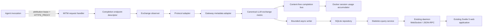

# MITM LLM Statistics: Implementation Plan

**Status:** Implemented and validated after architecture, adversarial, integration, and simplification review

**Date:** 2026-08-15

**Branch:** `codex/mitm-statistics`, based on `master` / `origin/master` at `2204b246d30e83029c8c1c7195758dd95b7ed8d9`

**Scope:** Docker/PTY agent traffic observed by the TLS-terminating MITM proxy. Built-in sessions are not a primary target.

## 1. Decision summary

Implement a content-free, per-exchange metrics subsystem next to—rather than on top of—the live token stream and trajectory-capture systems.

The subsystem will:

1. Define completion endpoints by explicit wire protocol rather than infer protocol from hostnames.
2. Bind immutable invocation/session attribution before requests enter a shared proxy.
3. Observe the original request, the post-rewrite request actually sent upstream, and the upstream response without changing or delaying forwarding.
4. Normalize provider usage into nullable input, cache, thinking/reasoning, non-thinking output, total output, total-token, cost, outcome, and timing fields.
5. Preserve requested, forwarded, response-reported, and router-selected model/provider identities separately.
6. Publish a content-free completion event for live Docker session accounting and asynchronously persist the same canonical record in SQLite.
7. Expose a storage-neutral query service through the daemon's existing authenticated WebSocket/JSON-RPC server so the existing Svelte 5 application can add Token Envy-style visualizations later without a second server or changes to proxy capture, protocol parsing, persistence schema, or session accounting.

This does **not** make Docker token budgets enforceable. Once an exact-attribution, metrics-capable path is active, `DockerAgentSession.getBudgetStatus()` will report observed usage and `tokenTrackingAvailable: true` with a separate completeness status; Docker turns will not call `ResourceBudgetTracker`, token stop conditions, warnings, or exhaustion checks.

## 2. Why a new subsystem is required

### Current live token stream

`TokenStreamBus` is designed for transient presentation. It has no history or replay and carries assistant/tool content (`src/docker/token-stream-bus.ts`, `src/docker/token-stream-types.ts`). Its current terminal usage is not reliable enough for accounting:

- Anthropic `message_delta` emits zero input tokens (`src/docker/sse-extractor.ts:266`).
- OpenAI Responses terminal events discard input/output totals (`src/docker/sse-extractor.ts:312`).
- Chat Completions can emit a terminal event for `finish_reason` and a second one for `[DONE]` (`src/docker/sse-extractor.ts:295`, `src/docker/sse-extractor.ts:336`).
- Missing numeric fields often become zero rather than unknown.
- Its response branch may receive compressed bytes, while trajectory capture alone owns decompression.

The live bus may eventually consume canonical metrics, but it cannot be the source of truth.

### Current trajectory capture

Trajectory capture has useful exchange lifecycle machinery, but it is opt-in, intentionally stores request/response content, and has training-data poison semantics (`src/docker/trajectory-*`). Statistics must work with `capture.enabled` off and must have a much narrower privacy boundary. Statistics therefore cannot be derived from trajectory JSONL.

### Current attribution

Shared workflow bundles mutate one proxy-wide `tokenSessionId`. The orchestrator explicitly documents that concurrent fan-out events can be attributed to whichever lane last flipped that value (`src/workflow/orchestrator.ts:2471`). Snapshotting that value at request entry prevents mid-response changes but does not identify which concurrent lane originated the request.

Exact per-session, per-state, per-mode, and `getBudgetStatus()` accounting must not ship on that seam.

## 3. Proposals considered

| Proposal                                                                        | Advantages                                                                | Decision                                                                                                                                                    |
| ------------------------------------------------------------------------------- | ------------------------------------------------------------------------- | ----------------------------------------------------------------------------------------------------------------------------------------------------------- |
| Extend `TokenStreamEvent.message_end` and persist bus events                    | Small local change; existing session subscription                         | Rejected as the authoritative path: content-bearing, live-only, duplicate-terminal and normalization gaps, no exchange identity or replay.                  |
| Derive metrics from trajectory records                                          | Existing exchange IDs, timestamps, and usage objects                      | Rejected: opt-in, body-bearing, different privacy/retention contract, incomplete protocol coverage.                                                         |
| Add another host/path metrics classifier in `mitm-proxy.ts`                     | Bounded initial patch                                                     | Rejected: repeats the drift already present among token extraction, trajectory capture, and OpenRouter path classification.                                 |
| Content-free exchange observer + protocol/gateway adapters + durable repository | Correct provider semantics, privacy boundary, future query surface        | **Selected.**                                                                                                                                               |
| Accept mutable fan-out attribution and label it best-effort                     | Avoids runtime plumbing                                                   | Rejected for session statistics. Bundle-only rows may be retained as explicitly ambiguous degradation, but are excluded from per-session claims and totals. |
| Immutable per-invocation attribution lease                                      | Correct across concurrent lanes and reverse-order completions             | **Selected and release-gating.**                                                                                                                            |
| Per-session JSONL                                                               | No new storage runtime                                                    | Rejected as the primary store: expensive longitudinal queries, awkward multi-process discovery/indexing, and more server work for visualizations.           |
| SQLite behind a repository interface                                            | Indexed raw exchange data, WAL readers/writers, migrations, future charts | **Selected.** Use a worker and bounded queue; never run synchronous database work on the proxy event loop.                                                  |

### 3.1 Review record

Three independent proposal and review tracks were reconciled into this plan:

- The architecture review defined the canonical record, adapter boundaries, attribution lease, persistence model, and query seam.
- The adversarial review challenged concurrency attribution, passive-forwarding claims, privacy, malformed and compressed streams, refusals, provider-controlled identities, crash loss, and bounded resource use. Its blockers are reflected as release gates and explicit degraded states.
- The integration and validation review mapped the design onto Docker invocation, PTY, proxy, workflow orchestration, session accounting, SQLite ownership, JSON-RPC, and lifecycle seams on `master`, then defined phased tests and rollback boundaries.

A second blocker-only pass reconciled deliberate provider negotiation with byte-preserving observation, corrected response finalization timing, separated transport from gateway attempts, made token provenance and unknown values explicit, and constrained availability claims to exact, metrics-capable attribution.

## 4. Architecture



### 4.1 Source layout

```text
src/docker/llm-observation/
  completion-endpoint.ts
  exchange-context.ts
  content-decoder.ts
  response-observation-hub.ts
  sse-event-framer.ts

src/llm-metrics/
  types.ts
  attribution-registry.ts
  exchange-observer.ts
  protocol-registry.ts
  normalization.ts
  event-bus.ts
  observed-usage-accumulator.ts
  protocols/
    anthropic-messages.ts
    openai-responses.ts
    openai-chat-completions.ts
    google-generate-content.ts
  gateways/
    direct.ts
    openrouter.ts
    ironcurtain.ts
    opaque.ts
  persistence/
    repository.ts
    sqlite-worker.ts
    sqlite-repository.ts
    migrations.ts
  query-service.ts

src/web-ui/dispatch/statistics-dispatch.ts
```

The exact directory split may be adjusted to satisfy dependency-cycle checks, but generic completion routing, exchange lifecycle, decoding, and SSE framing must live outside the statistics and trajectory implementations so both can consume them. Protocol fact normalization, trajectory content reconstruction, gateway routing metadata, persistence, and Docker session accounting remain separate modules.

Construct one process-scoped metrics runtime (bus, repository worker, health, and query reader), reference-count it across proxies, and inject it through `MitmProxyOptions`; do not create one SQLite worker per proxy. Standalone CLI and daemon ownership paths each perform one bounded final flush/close.

The statistics reader is injected into the existing `WebUiServerOptions` and `DispatchContext`, and `statistics.*` is routed by the existing `src/web-ui/json-rpc-dispatch.ts`. The daemon continues to serve the compiled Svelte SPA and authenticated `/ws` endpoint from `WebUiServer`; statistics add no HTTP listener, WebSocket server, port, authentication scheme, or alternate frontend transport. Shared DTO definitions in `src/web-ui/web-ui-types.ts` remain the server/frontend contract.

### 4.2 Completion endpoint descriptor: one protocol source of truth

`ProviderConfig` currently combines host allowlisting, credentials, rewrites, and upstream overrides but has no explicit protocol (`src/docker/provider-config.ts:94`). Introduce:

```ts
type BuiltInLlmProtocol =
  | 'anthropic-messages'
  | 'openai-responses'
  | 'openai-chat-completions'
  | 'google-generate-content';

type LlmProtocolId = BuiltInLlmProtocol | (string & {});

interface CompletionEndpoint extends EndpointPattern {
  readonly protocol: LlmProtocolId;
  readonly capabilities: {
    readonly metricsSupport: 'full' | 'partial' | 'unsupported';
    readonly streamingUsageNegotiation?: 'client_or_agent_adapter' | 'rewrite_if_already_buffered' | 'none';
  };
}

interface ProviderConfig {
  readonly id: string; // stable route/service id, not display text
  readonly completionEndpoints: readonly CompletionEndpoint[];
  readonly gatewayAdapterId: string;
  // existing host, allowlist, auth, rewrite, and upstream fields
}
```

The descriptor becomes the source for statistics observability behavior:

- whether a request is a completion worth observing;
- which protocol adapter parses it;
- token-stream protocol selection where still needed;
- a future trajectory reassembler migration after capture-parity tests.

`allowedEndpoints` remains the sole forwarding authorization source. Every completion descriptor must be a validated subset of it; observability configuration must never expand network authority. Reject duplicate or overlapping completion descriptors at startup.

Protocol and gateway IDs are registry keys, not hard-coded switch exhaustiveness spread throughout the proxy. Built-ins register at startup; an own-provider integration can reuse a built-in wire protocol and supply only a gateway adapter, while a genuinely new dialect can add one adapter without editing existing providers.

Migration preserves the existing endpoint authorization behavior byte-for-byte. Trajectory content capture remains independently allowlisted. Do not derive `captureEndpoints` broadly from observed completion descriptors, because that could silently begin storing content for a newly supported Chat/Google route. The implementation retains the current trajectory allowlist and host/path reassembler selection while reusing its generic decoder and SSE framer; migrating those provider classifiers is a later capture-only refactor after parity tests, not a statistics release dependency.

OpenRouter proves why this is necessary: one host exposes Anthropic Messages, OpenAI Responses, and Chat Completions depending on path (`src/docker/openrouter.ts:203`). A private OpenAI-compatible provider should reuse the OpenAI adapter by declaring a protocol, without adding its hostname to parser code.

### 4.3 Provider, gateway, protocol, and upstream are different dimensions

Persist these separately:

- `logical_provider`: the API/service configuration selected by IronCurtain (`anthropic`, `openai`, `openrouter`, or a custom stable ID).
- `provider_profile_id`: the resolved provider profile selected for the invocation. Thread the selected name/ID explicitly; the current resolved profile object loses the selected name.
- `protocol`: the wire dialect.
- `client_route_id`: the canonical host requested by the agent when it is a known public provider origin; otherwise a configured stable ID or local HMAC.
- `upstream_route_id`: the actual configured network route after a base-URL override. Known public origins may use canonical scheme/host/port; private/custom origins use a stable configured ID or local HMAC, never credentials, query, or arbitrary path data.
- `gateway_kind`: direct, OpenRouter, IronCurtain-owned, or opaque/custom.
- `served_provider`: only when reported by a trusted configured gateway/provider.

An Anthropic-format call forwarded to a private base URL remains `protocol=anthropic-messages`; it is not assumed to have been served by Anthropic.

Select the gateway adapter only after resolving the effective upstream route. `direct` is valid only for a verified official provider origin. Any base-URL override defaults to `opaque`, even if it preserves an Anthropic/OpenAI/Google client protocol, unless that configured route explicitly opts into a trusted gateway adapter/contract.

### 4.4 Immutable attribution lease

Add a metrics invocation lifecycle to `DockerInfrastructure`:

```ts
interface MetricsInvocationContext {
  sessionId: SessionId;
  agentConversationId?: string;
  bundleId: BundleId;
  workflowRunId?: string;
  stateId?: string;
  personaId?: string;
  turnId?: string; // exact for batch turns; absent for a session-long PTY lease
  agentName: AgentId;
  providerProfileId: string;
}

interface MetricsInvocationLease {
  readonly proxyUrl: string;
  end(): Promise<void>; // revoke and wait for attributed in-flight observers
}
```

The selected transport is a short-lived opaque lease ID carried as proxy credentials in the per-invocation `HTTP_PROXY`/`HTTPS_PROXY` URL. The lease ID contains no session data. The MITM validates `Proxy-Authorization`, maps the lease to `MetricsInvocationContext`, strips the proxy credential at the boundary, and stores a lease reference in connection metadata. At every inner HTTP request—not only CONNECT—it re-acquires the still-active lease and snapshots an immutable request context. A keep-alive tunnel therefore cannot create newly attributed requests after revocation. Separate CLI processes in parallel lanes use separate leases even though they share a proxy.

Implementation requirements:

- Replace/extend `ContainerRuntime.exec()` with an options object containing per-exec environment overrides; implement Docker `exec --env` and validate the corresponding Apple Container syntax before Phase 2.
- Remove or make lease-aware any agent config that pins the container-start proxy URL. In particular, Claude Code's entrypoint currently copies `HTTPS_PROXY` into persistent settings; per-exec environment alone is not sufficient until precedence is proven.
- Validate proxy-auth propagation through TCP sidecar, host-only TCP, and UDS relay topologies.
- Use `agentConversationId` as the OpenRouter cache-affinity key, falling back to `sessionId` only when unavailable. Never use a short-lived lease or turn ID; repeated turns/resumes of one conversation must retain affinity while concurrent conversations differ.
- Reference-count in-flight requests. Lease revocation prevents new requests but waits, with a bounded timeout, for existing exchanges to finalize.
- Never log or persist the lease credential. Redact it from formatted commands, runtime errors, process listings captured by diagnostics, audit logs, and proxy logs.
- A missing/invalid lease produces `attribution_quality='bundle_only'` or `unattributed`; it must never borrow the last active session.

If a client/runtime cannot propagate proxy authentication, the fallback design is a distinct proxy ingress per invocation. The feature does not ship exact per-session statistics until one mechanism passes the true concurrent fan-out test.

The lease is a correlation mechanism for benign concurrency, not a security boundary between processes sharing one container/user. A malicious co-resident process may be able to read or reuse another process's proxy settings. Attribution must never authorize traffic, select policy, or enforce budgets.

Batch sessions use one lease per turn. A PTY uses one session-long lease from before agent startup through its final proxy drain, so PTY rows have exact session attribution but no claimed turn attribution. If a bounded lease drain times out, late exchanges retain their original context and can update only that original turn/session accumulator; they never roll into a later turn. If the target turn/session has already closed, persistence retains the exchange and the in-memory turn remains explicitly partial.

Thread the source context through `WorkflowBorrowOptions`, `DockerAgentSessionDeps`, and workflow execution options using the existing branded `AgentId`/`AgentConversationId`/session types. Generate a fresh batch `turnId` inside `sendMessageDetailed()`. Preserve the selected provider-profile name before `resolveActiveProfile()` reduces it to a resolved profile object. PTY setup receives pre-container infrastructure, so it registers its session lease before container creation, injects the lease-aware proxy URL into the fixed environment/settings, and revokes it only before final proxy teardown.

The current `setTokenSessionId` can remain temporarily for live UI compatibility. Statistics do not use it. Trajectory capture can migrate to the same request context later.

### 4.5 Exchange lifecycle

One `exchange_id` represents one inbound completion HTTP request. An internal managed 401 refresh retry is another upstream attempt on the same exchange. A retry initiated by the agent/CLI is a new exchange and must not be heuristically deduplicated.

Lifecycle:

1. Authorize the endpoint.
2. Resolve the `CompletionEndpoint`, validate attribution, and create `ExchangeContext` before key swapping.
3. Observe the original request and, after any rewriter, the exact outgoing request metadata.
4. Record each upstream attempt; the drained 401 is not treated as the completion response.
5. On the final upstream response, attach a passive decoded observation branch before forwarding.
6. Feed decoded SSE/JSON facts to the protocol adapter and optional gateway adapter.
7. Record protocol terminal as a milestone, not as finalization. On a normal response, finalize exactly once after upstream body settlement and client delivery finish/abort are known. On upstream error, client abort, or teardown, finalize a partial record once (using a bounded grace period after a previously observed terminal event).
8. Publish the canonical record to a no-throw in-memory metrics bus that isolates every subscriber behind an exception boundary, then enqueue persistence asynchronously behind a separate exception boundary.

HTTP completion, protocol completion, and usage completeness are independent fields. A response may end cleanly without a protocol terminal or without usage.

### 4.6 Passive request and response observation

Forwarding is the invariant after any deliberate provider-capability negotiation: raw upstream response bytes, headers, status, ordering, compression, and backpressure behavior seen by the agent must not be modified by the observation branch.

Two allowlisted negotiations may deliberately change an upstream request and therefore its response shape: requesting OpenRouter routing metadata and asking a compatible Chat endpoint to include streaming usage. These are provider-route capabilities, not side effects of attaching the metrics observer. Configure them independently of `statistics.enabled`, default unknown compatible providers to no mutation, and compatibility-test each supported agent/protocol. Chat usage negotiation occurs in the client/agent adapter when possible; the MITM may inject it only when another declared rewrite already buffers that request. It never forces a large/chunked pass-through request into `MAX_REWRITE_BODY_BYTES`; otherwise coverage is partial. Metrics on/off byte-fidelity tests compare forwarding under the same negotiated request. Every other metrics operation is passive.

Request observation:

- On an existing rewrite/buffer path, inspect the parsed pre-rewrite and post-rewrite objects.
- On a streaming pass-through path, tee bytes to an incremental JSON metadata extractor that retains only registered scalar fields (for example `model`, `stream`, reasoning settings, and service tier). It must not retain message/tool/content arrays.
- Cap every retained string and collection. Overflow or malformed input sets a quality flag and leaves facts null; it does not reject or buffer the request.
- Bound nesting depth, scalar count, duplicate-key handling, bytes examined, and parser CPU work per exchange.
- Do not force all completion requests through `MAX_REWRITE_BODY_BYTES`; that would add latency and change acceptance of large/chunked requests.

Response observation:

- Extract a shared generic decoder from the trajectory decompression precedent (`src/docker/trajectory-tap.ts`) for `identity`, gzip, deflate, and br.
- Keep raw compressed forwarding in its existing path.
- Observation consumers are bounded and cannot backpressure forwarding. If a decoder/parser falls behind or fails, detach it, finalize a partial record with quality flags, and increment health counters.
- Bound compressed bytes inspected, decompressed bytes, expansion ratio, event size, nesting depth, and parser work. If a decoder's `write()` signals backpressure, detach and destroy that observation branch rather than accumulate behind it.
- SSE framing must use `StringDecoder`, accept CR/LF/CRLF and multi-line data, tolerate unknown additive events, and be tested at every byte split.
- Non-streaming JSON uses an incremental fact extractor or bounded parser. Overflow records partial/missing usage rather than disappearing.

Metrics and trajectory capture share the same characterized decoder and SSE-framing primitives, but each owns an independently bounded observation branch. Statistics therefore cannot inherit trajectory session poisoning or content retention, and trajectory capture cannot inherit statistics sampling, persistence failures, or availability state.

### 4.7 Shared observation infrastructure with trajectory capture

This work deliberately improves trajectory capture rather than building a parallel MITM stack. It extracts and characterizes these mechanisms before attaching metrics:

- Move response content-decoding behavior from `trajectory-tap.ts` into a generic bounded decoder used by both consumers. Raw upstream bytes still have exactly one forwarding path; decoded observation remains a side branch.
- Extract the `StringDecoder`-based SSE line/event framing from `trajectory-reassembler.ts` into a provider-neutral framer. Metrics adapters consume only registered scalar facts, while trajectory reassemblers use the same framing implementation to reconstruct content.
- Preserve trajectory's independently allowlisted host/path `createReassembler()` selection in this feature. A later capture-only refactor may select its parser from `CompletionEndpoint.protocol` after full golden-record parity coverage.
- Reuse immutable `ExchangeContext`, attempt lifecycle, response settlement, abort, and timing facts. The trajectory consumer adds its session/poison semantics; the metrics consumer adds canonical content-free normalization and persistence.
- Preserve the existing trajectory writer, records, capture opt-in, content redaction, poison behavior, and retention contract. Statistics never read trajectory files and trajectory capture remains independently disabled by default.

Each branch isolates its consumer with hard byte/work bounds. A disabled, slow, poisoned, or failed trajectory consumer cannot make metrics incomplete; a failed metrics parser/writer cannot poison or truncate a trajectory. Keeping separate decoder instances when both features are enabled is deliberate: it prevents a content-bearing trajectory consumer's backpressure, poisoning, and lifecycle from entering the content-free accounting path. Characterization tests prove trajectory output is structurally unchanged by the extracted shared primitives.

### 4.8 Implementation qualification

The implementation was qualified on this branch with:

- the complete non-real-container root matrix: 273 files and 5,709 tests passed, with 114 explicitly skipped and one existing todo;
- the Svelte 5 workspace matrix: 27 files and 468 tests passed;
- clean TypeScript, script type-check, ESLint, Prettier, dependency-cycle, production-build, and diff checks;
- a real Claude Code / Haiku one-shot that persisted two exactly attributed Anthropic exchanges. Their canonical totals summed to 25,906 input plus 104 inclusive output = 26,010 tokens, exactly matching the CLI session total; the main exchange separated 43 thinking from 49 non-thinking output tokens;
- a content canary scan proving the smoke prompt was absent from the statistics database, plus `0700` directory and `0600` key/database permission checks.

## 5. Canonical record and semantics

### 5.1 Identity

Never collapse model identity into one field:

| Field             | Meaning                                                                   | Authority                               |
| ----------------- | ------------------------------------------------------------------------- | --------------------------------------- |
| `requested_model` | Model in the agent-facing request before IronCurtain rewrites             | Exact when request parsing succeeds     |
| `forwarded_model` | Model in the final body IronCurtain actually sent to the upstream/gateway | Exact when outgoing parsing succeeds    |
| `response_model`  | Normal protocol model identifier reported in the response                 | Provider-reported                       |
| `served_model`    | Backend model selected by a router/gateway                                | Only router/provider metadata; nullable |
| `served_provider` | Backend provider selected by a router/gateway                             | Only router/provider metadata; nullable |

Each reported identity has a source enum such as `request`, `forwarded_request`, `protocol_response`, `router_metadata`, `trusted_gateway_header`, or `not_exposed`.

`served_model` is the answer to “what actually served this request.” It remains null when an opaque gateway does not expose that fact. A display/query layer may show `forwarded_model` as the best routed model, but must label it as routed—not actually served.

For OpenRouter, opt in at the provider-route layer with `X-OpenRouter-Metadata: enabled` and parse a strict allowlist from the documented final `openrouter_metadata` object. Retain only the selected endpoint and bounded attempt provider/model/status fields. Explicitly discard `summary`, `pipeline`, `pipeline.data`, router parameters, and unknown nested objects; pipeline data may reflect request-content matches. Apply depth, array-length, and string caps. Capture the bounded `X-Generation-Id` for correlation, but do not call `/generation` in the hot path. See [OpenRouter router metadata](https://openrouter.ai/docs/guides/features/router-metadata) and [streaming generation IDs](https://openrouter.ai/docs/api/reference/streaming).

For an IronCurtain-owned provider/gateway, define a versioned response contract with resolved provider, resolved model, request ID, and route attempts in explicit headers or terminal metadata. Its gateway adapter is the only reader of that contract. Other custom gateways use the opaque adapter unless explicitly configured.

### 5.2 Token usage

All optional numeric fields are nullable. Zero means the upstream explicitly reported zero. Token/count fields must be nonnegative safe integers; invalid, negative, fractional, non-finite, unsafe-integer, or contradictory counts become null and add quality flags. Cost accepts a finite nonnegative decimal and remains nullable.

```ts
interface NormalizedUsage {
  inputTokensReported: number | null;
  inputTokensTotal: number | null;
  inputTokensUncached: number | null;
  cacheReadInputTokens: number | null;
  cacheWriteInputTokens: number | null;
  toolUseInputTokens: number | null;

  outputTokensReported: number | null;
  outputTokenSemantics: 'includes_thinking' | 'excludes_thinking' | 'no_thinking_breakdown' | 'unknown';
  outputTokensTotal: number | null; // normalized inclusive generated output
  thinkingTokens: number | null;
  nonThinkingOutputTokens: number | null;

  providerTotalTokens: number | null;
  canonicalTotalTokens: number | null;
  costUsd: number | null;

  usageSource: string | null;
  usageCompleteness: 'complete' | 'partial' | 'missing' | 'invalid';
  usageSemanticsVersion: number;
  measurementProvenance: {
    readonly input: 'provider_exact' | 'provider_estimate' | 'derived' | 'unknown';
    readonly output: 'provider_exact' | 'provider_estimate' | 'derived' | 'unknown';
    readonly thinking: 'provider_exact' | 'provider_estimate' | 'unknown';
    readonly nonThinking: 'provider_exact' | 'derived' | 'derived_from_estimate' | 'unknown';
  };
  qualityFlags: readonly string[];
}
```

Normalization rules:

- Anthropic input total is `input_tokens + cache_read_input_tokens + cache_creation_input_tokens`; `inputTokensUncached` is `input_tokens`.
- OpenAI Responses input total is `input_tokens`; `input_tokens_details.cached_tokens` is already a subset, and uncached input is total minus the valid cached subset.
- Chat Completions input total is `prompt_tokens`; `prompt_tokens_details.cached_tokens` is already a subset, and uncached input is total minus the valid cached subset.
- Google `inputTokensReported` is `promptTokenCount`; `toolUseInputTokens` is `toolUsePromptTokenCount`; normalized input total is their valid sum. Cached input is a subset of the prompt count, and uncached input is normalized input minus that valid subset.
- Anthropic and OpenAI output/completion counts include thinking/reasoning when their documented breakdown is present.
- Google GenerateContent reports `candidatesTokenCount` excluding `thoughtsTokenCount`; normalized inclusive output is their valid sum, while non-thinking output is the candidate count. With valid tool-use input, its canonical total should equal `promptTokenCount + toolUsePromptTokenCount + candidatesTokenCount + thoughtsTokenCount`; retain and validate the provider-reported `totalTokenCount` separately.
- A custom adapter must declare output inclusion semantics before an inclusive output or non-thinking value is derived.
- Thinking/reasoning is read only from provider-supplied breakdowns. It is never estimated by tokenizing returned reasoning text.
- `nonThinkingOutputTokens = outputTokensTotal - thinkingTokens` only when the protocol guarantees inclusion and `0 <= thinking <= output`; otherwise it is null.
- `canonicalTotalTokens = inputTokensTotal + outputTokensTotal` only when both are valid under the adapter's semantics.
- A strictly allowlisted numeric provider-usage map may be retained for forward-compatible re-normalization. Arbitrary provider JSON is forbidden.

Protocol adapters define field-by-field event precedence. Repeated cumulative counters are never summed. For Anthropic, initial input/cache fields and terminal output/thinking fields are authoritative for their respective dimensions; repeated, regressing, or conflicting values are quality-flagged and resolved only by the frozen protocol rule. The same explicit rule is required for every compatible protocol before it is marked metrics-capable.

Thinking tokens remain included in `BudgetStatus.totalOutputTokens`; their separate value is exposed through statistics DTOs because `BudgetStatus` currently has no thinking field.

Provider-supplied does not always mean exact. Adapters assign measurement provenance per token dimension from the provider's documented contract; a subtraction involving an estimated thinking count is `derived_from_estimate`. Summary/query coverage groups or filters by this provenance so charts do not present estimates as exact counts.

### 5.3 Modes and dimensions

Capture only allowlisted scalar inference settings needed for grouping:

- requested/actual service tier;
- reasoning mode (`disabled`, `enabled`, `adaptive`, `effort`, `unknown`);
- reasoning effort string;
- thinking budget tokens;
- provider speed mode when explicitly exposed;
- streaming/non-streaming;
- agent kind and provider profile ID.

Adapters map provider-specific request fields into these dimensions. Unknown future model IDs require no parser change. Model-family aliases and groupings belong in the query layer so historical rows do not need rewriting.

### 5.4 Outcome and refusals

Store a normalized termination category:

```text
stop | length | tool | refusal | content_filter | error | aborted | unknown
```

Also store a normalized provider stop/finish reason enum, response status, a refusal boolean/category, and a source enum. Unknown raw reasons become `other`; never persist refusal text, raw stop strings, or provider error messages.

The MITM can identify provider/API refusal signals such as explicit refusal content item types, content-filter finishes, or documented stop reasons. It cannot reliably reproduce Token Envy's Claude Code client outcomes (`recovered by fallback` versus `user-visible refusal`) because those are client transcript events after the API response. Those fields remain nullable. A future client-outcome annotation can link by provider request/exchange correlation without changing exchange capture.

### 5.5 Timing

Persist UTC wall time for display and monotonic offsets/durations for calculations:

- request received;
- request body complete;
- each upstream attempt start;
- response headers / first byte;
- first protocol event;
- first/last reasoning event;
- first/last non-reasoning output event;
- protocol terminal;
- upstream response end;
- client delivery finish or abort.

Do not persist one ambiguous `tokens_per_second` value as truth. The query layer derives, with a formula/version label:

- Token Envy-compatible client-observed effective output TPS: inclusive output / request-received-to-successful-client-delivery-finish; aborted/failed deliveries are excluded or explicitly flagged;
- upstream service-span rate: inclusive output / upstream-attempt-start-to-upstream-response-end, labeled separately from client-observed TPS;
- observed stream-span rate: inclusive output / first generated reasoning-or-output event to last generated event, only for a positive span and when the adapter establishes that the reported count covers that observed population;
- non-thinking stream-span rate: non-thinking output / first-to-last non-thinking event under the same population rule;
- thinking stream-span rate: thinking output / first-to-last reasoning event under the same population rule;
- TTFT and total latency;

SSE event timing is an observation-time approximation, not token-level decoder timing. Single-event, non-streaming, hidden/summarized-reasoning, nonpositive-span, and mismatched-population rates are null.

Persist completeness flags with every primitive so queries can exclude invalid denominators and report coverage rather than silently biasing toward well-behaved providers.

## 6. Persistence

### 6.1 Store

Use a host-global SQLite database:

```text
${IRONCURTAIN_HOME}/statistics/llm-usage.sqlite3
```

Add its path through `src/config/paths.ts`. The parent directory is `0700`; database, WAL, and SHM are user-only. Statistics remain local and are never exported automatically.

Primary tables:

- `llm_exchanges`: one immutable finalized row per `exchange_id`;
- `llm_transport_attempts`: MITM upstream/auth attempts keyed by exchange and transport ordinal;
- `llm_gateway_route_attempts`: gateway backend/model attempts keyed by exchange and gateway ordinal, with metadata authority/source;
- SQLite `user_version` plus explicit transactional migrations.

Start with indexes on completion time, session/time, and provider plus served/routed model/time. Add workflow, profile, mode, outcome, and quality indexes only when query-plan/load benchmarks justify their write amplification.

Use `node:sqlite` in a dedicated worker and raise the Node engine floor from `>=22.0.0` to a release where it is available without a flag (proposed `>=22.13.0`). Gate this change in the existing Node 22/24/26 CI matrix. If retaining Node 22.0 is mandatory, select and package a supported SQLite binding instead; do not add an unindexed JSONL fallback that changes query semantics.

### 6.2 Write behavior

- The proxy performs only O(1) in-memory enqueue work.
- A dedicated worker batches small WAL transactions with a busy timeout and bounded retry.
- The queue is hard-bounded by record count and bytes.
- Queue overflow, disk full, busy exhaustion, corrupt/future schema, migration failure, or worker failure increments visible health counters and drops metrics; inference continues.
- `exchange_id` is a uniqueness/idempotency key.
- Shutdown performs a bounded flush. It never hangs container teardown indefinitely.
- Unknown newer schema versions disable persistence safely and visibly; they are not rewritten.
- Multi-process migrations acquire `BEGIN IMMEDIATE`, then re-read `user_version` under the write lock before each transactional migration. Readers see the prior committed schema until commit; concurrent starters retry or observe the new version.
- Because old IronCurtain processes may remain alive after another process migrates the host-global database, in-place migrations are additive/backward-compatible and every writer batch re-checks the compatible schema range. A breaking schema uses a new versioned database/table family or requires exclusive version ownership; a new binary must not strand an old daemon writing an incompatible layout.
- Retention is an elected/idempotent chunked job; processes do not concurrently vacuum or run unbounded deletes.
- Multiple IronCurtain processes writing while the web UI reads must be supported and tested.

The queue is intentionally not a durable journal. A hard process crash can lose its bounded in-memory tail. Before enabling durable observation, synchronously persist a process-run start marker; durably checkpoint monotonically increasing observed/finalized/enqueued counters at bounded intervals; and write a clean-end marker on flush. A crash then indicates possible loss since the last durable checkpoint, not exact missing rows. If the start marker cannot be written, persistence is visibly unhealthy and makes no durable-gap claim. The durability contract is transaction atomicity and idempotent duplicate insertion—not crash replay. Health during database/worker failure remains available in memory and rate-limited logs; the failed database cannot be the sole durable record of its own outage.

There is no automatic backfill from trajectories or agent transcripts. Existing sessions legitimately have no records. A future offline importer must be explicit, versioned, and idempotent.

### 6.3 Privacy and retention

The database has a strict column allowlist. Never persist:

- prompts, completions, thinking text, or tool data;
- request/response bodies;
- arbitrary headers, query strings, URL credentials, or API/fake/lease keys;
- arbitrary provider JSON or human-readable error/refusal text;
- user messages or filesystem paths.

Treat all provider/model/mode/generation/stop identifiers and upstream metadata as attacker-controlled. Validate known enums, cap every string/array, and map unknown enum values such as stop/reason categories to `other` without raw text. Model/provider identifiers are not enums: retain bounded validated identifiers needed for custom/future model analysis, with a local HMAC fallback when they violate the safe identifier grammar. Generated session/workflow/bundle IDs may be stored.

Create one 32-byte identity key atomically at `${IRONCURTAIN_HOME}/statistics/identity.key` with mode `0600` under the `0700` statistics directory. Derive opaque IDs as a namespace-separated HMAC-SHA256 (for example `profile\0<name>`, `persona\0<name>`, `route\0<origin>`) truncated to at least 128 bits. The query service can map currently configured labels to these IDs in memory; labels are not duplicated in exchange rows. Key deletion/rotation is an explicit statistics reset and intentionally breaks longitudinal grouping; there is no legacy derivation with a new key. Store a configured stable route ID for private upstreams; raw private hostnames are omitted or locally HMACed by default.

Add `statistics.enabled`, retention, health, and delete controls. Recommended rollout is configurable/shadow-on first; enable by default only after the privacy and overhead gates pass. Retention policy is applied asynchronously and never from the proxy request path.

Keep JSON-RPC statistics methods read-only. Provide a local management/CLI surface such as `ironcurtain statistics delete --before <time>` and `--all`; `--all` deletes through a snapshot cutoff taken at command start, so concurrent writers may add newer rows. Deletion runs as chunked transactions through the repository management channel, coordinates with the elected retention worker, reports its cutoff/count, and never blocks proxy forwarding. Deleting/rotating `identity.key` is a separate explicit full-reset operation after exchange deletion.

## 7. Docker session accounting without budget enforcement

Add `ObservedUsageAccumulator`, subscribed by exact `sessionId` to the new content-free completion bus.

Responsibilities:

- deduplicate by `exchange_id`;
- call `beginTurn()` before batch lease acquisition, aggregate every exchange carrying that `turnId`, and call `endTurn()` only after lease drain;
- maintain active-turn and cumulative normalized input/output/total/cache/cost counts; top-level `BudgetStatus` counters reset between turns while cumulative counters do not;
- snapshot per-turn usage into `ConversationTurn.usage` instead of zeros (`src/docker/docker-agent-session.ts:347`);
- extend `ConversationTurn` history/DTO usage with `usageCompleteness: 'complete' | 'partial' | 'unavailable'` and observed/missing exchange counts, so a late or missing exchange cannot be represented as an exact zero;
- replace the OpenRouter-only cost subscription with canonical provider cost when available, retaining CLI cost as fallback;
- expose tracking availability and completeness separately from token counts. Sum individually valid dimensions; when an exchange is missing/invalid for a dimension, the corresponding total is a lower bound and tracking status is partial.

`DockerAgentSession.sendMessageDetailed()` obtains an invocation lease before `docker.exec`, ends it after the process and attributed exchanges drain, and then snapshots the turn. A PTY obtains a session-long lease before agent startup and closes it after the final proxy drain. `getBudgetStatus()` returns active-turn and cumulative observed values (`src/docker/docker-agent-session.ts:441`). `tokenTrackingAvailable` is true only when an exact-attribution, metrics-capable path and session accumulator are active. Extend the status/transport DTO with `tokenTrackingStatus: 'complete' | 'partial' | 'unavailable'` (and observed/missing exchange counts) so partial lower-bound totals are not presented as complete.

It must **not**:

- instantiate or call `ResourceBudgetTracker` for token/cost decisions;
- create a token stop condition;
- block a new Docker turn after token/cost limits are exceeded;
- emit token/cost budget exhaustion diagnostics.

The existing Docker wall-clock exec timeout remains unchanged because it is an independent runtime safety mechanism.

Rows with ambiguous/bundle-only attribution contribute to bundle/workflow aggregates but not a Docker session accumulator. This is why exact invocation attribution is a release gate for truthful session status.

Per-exchange canonical cost and a CLI's cumulative fallback are different authorities. Prefer summed canonical cost only when every cost-bearing exchange in the covered interval reports cost; otherwise mark it partial and retain a complete CLI cumulative total when one is available. Never replace a complete cumulative report with a known-partial sum. Keep the workflow's existing live token-bus accounting unchanged during this feature to avoid double counting.

## 8. Query and future visualization seam

Implement a storage-neutral reader now, before a dashboard:

```ts
interface LlmStatisticsReader {
  listExchanges(query: ExchangeQuery): Promise<CursorPage<LlmExchangeDto>>;
  summarize(query: SummaryQuery): Promise<readonly MetricSummary[]>;
  timeSeries(query: TimeSeriesQuery): Promise<readonly TimeBucket[]>;
  dimensions(query: DimensionQuery): Promise<readonly DimensionValue[]>;
  sessionTotals(sessionId: SessionId): Promise<LlmUsageTotals>;
  capabilities(): Promise<StatisticsCapabilities>;
}
```

Add read-only, versioned methods through a new `statistics.` web dispatcher:

- `statistics.capabilities`
- `statistics.summary`
- `statistics.series`
- `statistics.exchanges`
- `statistics.dimensions`

Queries use enumerated filters, groupings, measures, bucket sizes, bounded time ranges, and stable keyset cursor pagination with a snapshot upper bound. Bound scanned rows, CPU time, response bytes, group cardinality, and quantile memory. Queries never accept SQL. DTOs never expose the allowlisted native-usage map unless a separate diagnostic method is deliberately added.

Initial dimensions:

- time, agent, logical provider, gateway, protocol, provider profile;
- requested/forwarded/served model and served provider;
- reasoning/service/speed mode;
- streaming, outcome/refusal, usage completeness, attribution quality;
- session/workflow/state/persona/bundle IDs.

Initial measures:

- request/refusal/error counts and rates;
- input/cache-read/cache-write/thinking/non-thinking/output/total token sums;
- cost;
- TTFT, upstream/client latency, effective TPS, and observable stream-span rates;
- median, IQR, and coverage/sample counts.

Keep raw exchange rows as the durable truth. Model families, output-size strata, outlier policy, medians/IQR, and session-clustered confidence intervals are versioned query/analysis logic. A Token Envy-style frontend then becomes chart and interaction work against this API, not a server capture redesign.

The daemon control socket does not need statistics methods unless a CLI command is later requested.

## 9. Provider/protocol behavior

### Anthropic Messages

- Parse streaming and JSON responses.
- Merge initial input/cache usage with terminal output/thinking usage.
- Parse response model, provider request ID, stop reason, and explicit refusal signals without retaining content.
- Treat missing thinking details as null, not zero.
- On a configured official direct origin, a response-reported model may populate `served_model` with `protocol_response_direct` provenance. Behind a base-URL override it remains only `response_model` unless trusted gateway metadata establishes the backend.

### OpenAI Responses

- Parse streaming and JSON `completed`, `incomplete`, and `failed` terminal envelopes.
- Read input/cached/output/reasoning/total usage and prefer terminal response model with earlier model as fallback.
- Observe refusal item types but never their text.
- Apply the same official-direct versus gateway identity rule as Anthropic.

### OpenAI Chat Completions

- Parse streaming and JSON.
- Parse the bounded response `model` identifier and apply the official-direct versus opaque-override served-model provenance rule.
- Consume a usage-only final chunk even when `choices` is empty.
- Treat `[DONE]` as transport termination, not a second completed exchange.
- For direct OpenAI, negotiate streaming usage through a declared provider-route capability that is stable regardless of metrics attachment. Do not mutate arbitrary compatible-provider requests unless explicitly configured and compatibility-tested as supporting it.

### OpenRouter

- Select one of the three protocol adapters by endpoint descriptor; do not fork their usage logic.
- Parse OpenRouter cost/cache fields and router metadata in a gateway adapter.
- Preserve requested model, IronCurtain-remapped forwarded model, selected served model/provider, and all fallback attempts.
- Metadata absence leaves served identity null with a quality/source flag. Never persist free-form router summary, pipeline, parameters, or pipeline data.

### Custom and IronCurtain-owned providers

- A custom provider declares a supported wire protocol and an opaque or explicit gateway adapter.
- A custom OpenAI-compatible provider reuses Responses or Chat parsing without host checks.
- Base-URL overrides preserve the client protocol but record the actual network upstream separately.
- An IronCurtain-owned gateway implements the versioned resolved-route contract, allowing authoritative destination model/provider capture without parser changes.

### Google

Implement its adapter immediately after the three requested protocol families, in the same feature series. The requested model normally comes from the single capped model segment in the GenerateContent URL, not the JSON body; do not persist the remaining path/query. Parse the bounded `modelVersion` response field and apply the official-direct versus opaque-override served-model provenance rule. Freeze and test the documented `promptTokenCount`, `cachedContentTokenCount`, `candidatesTokenCount`, `thoughtsTokenCount`, tool-use, and `totalTokenCount` relationships. Existing Google completion endpoints are already present, and leaving them silently classified as observable would create misleading coverage. Until its adapter lands, descriptor capability must explicitly say metrics unsupported and produce a health/coverage signal rather than zero usage.

## 10. Implementation phases

### Phase 0 — contracts, fixtures, and release-gating spikes

Deliverables:

- Freeze canonical record v1, nullable semantics, identity-source precedence, timing formulas, privacy allowlist, quality flags, DTO v1, and repository interface.
- Add real captured/synthetic fixtures for Anthropic Messages, OpenAI Responses, Chat Completions, OpenRouter's three skins, and Google, streaming and non-streaming.
- Prototype attribution leases through Docker TCP sidecar, host-only, UDS, Apple Container, batch, PTY, and true concurrent workflow fan-out.
- Verify container-runtime environment override syntax, Claude's persisted proxy-setting precedence, per-request lease revalidation on keep-alive, and session-long PTY injection before container creation.
- Prototype `node:sqlite` worker/WAL operation under supported Node versions and concurrent processes.

Exit gates:

- Reverse-order responses from two concurrent lanes retain their original session/turn.
- A tunnel opened under a lease cannot attribute a second keep-alive request after that lease is revoked.
- Proxy credentials never reach upstream or logs.
- SQLite driver and engine-floor choice is explicit and passes packaging CI.

### Phase 1 — endpoint descriptors and pure adapters

Deliverables:

- Add `CompletionEndpoint`, provider/gateway IDs, and protocol registry.
- Migrate built-in and OpenRouter provider factories without changing authorization.
- Extract the generic bounded content decoder and SSE event framer from trajectory capture without changing its independently allowlisted host/path parser selection or captured records.
- Implement pure request/stream/JSON protocol adapters and normalization.
- Implement direct, OpenRouter, opaque, and IronCurtain gateway adapters.

Exit gates:

- Streaming and JSON fixtures normalize identically where provider semantics match.
- Existing trajectory fixtures and golden records remain structurally identical with capture enabled, while capture-disabled requests allocate no trajectory content buffers.
- Every optional token field distinguishes absent from zero.
- Chat `[DONE]`, duplicate terminal events, and Anthropic split usage finalize once and correctly.

### Phase 2 — MITM exchange observer and exact attribution

Deliverables:

- Register/revoke invocation leases and thread immutable `ExchangeContext`.
- Extend `ContainerRuntime.exec`, Docker/Apple implementations, workflow/session dependency types, pre-container PTY setup, and provider-profile identity plumbing.
- Integrate original/post-rewrite request fact observation.
- Add passive decoded response hub and exact-once finalization.
- Attach statistics and trajectory through independently bounded branches using the shared decoder/framer primitives and prove either consumer can be disabled or fail without affecting the other.
- Track internal auth retry attempts, aborts, truncation, status, routing, and monotonic timing.
- Emit content-free `LlmExchangeCompleted` events.

Exit gates:

- With provider observability negotiation held constant, the metrics observation branch forwards the upstream response byte-for-byte and does not otherwise change client-visible behavior.
- Parser/decompressor faults and slow consumers never throw into or backpressure forwarding.
- Interleaved keep-alive and concurrent fan-out attribution is exact; unknown attribution is never guessed.

### Phase 3 — durable repository and health

Deliverables:

- Add paths, migrations, schema, indexes, WAL configuration, worker queue, batching, bounded flush, and retention job.
- Add health counters: observed, finalized, persisted, dropped, queue depth, parser failure, missing/partial/invalid usage, unsupported protocol/encoding, exact/bundle-only/unattributed, unresolved served model, DB errors, and flush latency.
- Add startup/restart behavior and future-schema fail-safe.
- Wire one process-scoped runtime through standalone CLI and daemon startup/shutdown; expose per-process health without claiming a separate daemon can see another process's in-memory drops.

Exit gates:

- Multi-process writers and a concurrent reader pass stress tests.
- Transactions are atomic, duplicate insertion of the same exchange ID is idempotent, and an unclean run marker identifies possible loss since the last durable counter checkpoint without claiming an exact loss count.
- Disk-full/busy/corrupt/read-only scenarios leave inference healthy and visibly degrade metrics.

### Phase 4 — Docker read-only usage integration

Deliverables:

- Add `ObservedUsageAccumulator` and per-turn drain barrier.
- Populate `ConversationTurn.usage` and Docker `getBudgetStatus()` totals.
- Set `tokenTrackingAvailable`/`tokenTrackingStatus` from exact attribution, endpoint capability, and observed completeness.
- Replace the OpenRouter-only cost tap with canonical cost plus existing fallbacks.

Exit gates:

- Input, thinking-inclusive output, and total counts match canonical completed exchanges.
- A configured token/cost limit below observed use does not stop or reject the next Docker turn.
- Wall-clock timeout behavior remains unchanged.

### Phase 5 — read/query API

Deliverables:

- Add repository reader, aggregation/formula versions, bounded queries, DTOs, dispatcher, and WebSocket JSON-RPC methods.
- Add method names/DTOs in `web-ui-types.ts`, route `statistics.` in the existing `json-rpc-dispatch.ts`, inject the reader through `DispatchContext` and `WebUiServerOptions`, construct it in the daemon, and close its reader/runtime during daemon shutdown. Use the existing authenticated `/ws` connection consumed by the Svelte 5 application; do not add another server or transport.
- Implement coverage-aware summary, timeseries, dimensions, and exchange pagination.
- Port Token Envy's median/IQR and session-clustered intervals as query/analysis utilities, not capture logic.

Exit gates:

- Query results match hand-computed fixture data across providers/modes.
- A real `WebUiServer` WebSocket integration test authenticates and exercises every `statistics.*` method through the same route used by the Svelte client.
- Missing/partial usage is reported as coverage and never silently coerced to zero.
- Range, scanned rows, CPU, response size, cardinality, quantile memory, cursor, and invalid-parameter abuse is bounded.

### Phase 6 — shadow rollout and enablement

Deliverables:

- Run configurable shadow capture, compare provider self-reports/CLI totals, and inspect health/coverage.
- Run privacy canaries, performance load tests, Docker integration, and guarded paid-provider smoke tests.
- Enable local statistics by default only after all gates pass; document retention/delete controls.

No visualization is required in these phases.

## 11. Validation matrix

### Protocol/provider

- Anthropic direct: SSE/JSON, identity/gzip/br, cache creation/read, thinking present/absent, explicit refusal.
- OpenAI direct Responses: SSE/JSON, cached input, reasoning, completed/incomplete/failed/refusal.
- ChatGPT Codex Responses path.
- OpenAI Chat: SSE/JSON, usage-only terminal, finish + `[DONE]` deduplication.
- OpenRouter Messages/Responses/Chat: model rewrite, routing metadata, selected endpoint, fallbacks, metadata absent, cost/cache, generation ID.
- OpenRouter cache-hit or early-failure responses where routing metadata is absent.
- Private gateway behind each base-URL override: canonical protocol retained, network upstream recorded, served model nullable unless reported.
- IronCurtain-owned provider contract: resolved provider/model and route attempts.
- Google generate/streamGenerateContent and thought-token usage.
- Unknown future model IDs and additive provider fields.

### Lifecycle/failure

- Byte-by-byte/random chunking, split multibyte UTF-8, CR/LF/CRLF and multi-line SSE.
- gzip/deflate/br, unsupported/corrupt/truncated compression, expansion bombs, and observer backpressure.
- Missing, zero, malformed, negative, fractional, overflowing, and contradictory usage.
- 400/refusal, 401 refresh success/failure, 3xx, 429, 5xx, SSE error.
- Disconnect before terminal and after terminal; oversized JSON; abrupt process/proxy teardown.
- Sequential keep-alive, concurrent requests, response completion in reverse order, true workflow fan-out.
- Tunnel open under lease, lease revoke, then another keep-alive request; the latter is never attributed to the revoked context.
- Agent/CLI retries as separate exchanges; internal auth retry as one exchange with two attempts.
- PTY clean exit, forced teardown, session resume, daemon restart.
- ChatGPT WebSocket/upgrade fast rejection produces no phantom completion exchange.
- Huge streaming/non-streaming JSON where terminal usage arrives after large content does not retain the content and either extracts bounded facts or reports partial coverage.
- Metrics with trajectory capture both off and on.
- Metrics-only, trajectory-only, and combined observation produce the same forwarded bytes and preserve existing trajectory golden records.

### Persistence/API

- Migration interruption, future schema, corrupt/read-only/full/busy database.
- Queue overflow and deliberately slow writer.
- Multiple writer processes plus visualization reads.
- SIGTERM bounded flush and restart.
- Cursor stability, time bounds, aggregation/group limits, formula-version behavior.

### Privacy

Place unique canaries in prompts, completions, reasoning text, tool inputs/results, arbitrary headers, credentials, query strings, URL paths, private upstream hostnames, provider-controlled identifiers, provider errors, router pipeline data, and refusal explanations. Search metrics-owned database/WAL/SHM files, health logs, and gap records; every content/credential/private-host canary must be absent or present only as the specified local HMAC. Separately verify that explicitly allowlisted request/generation IDs meet their format/cap contract. Existing generic MITM path logging is outside this database assertion and must never receive new lease credentials.

### Performance

- 100 concurrent long streams with metrics on/off.
- Bounded memory per exchange and bounded writer queue.
- Target less than 1 ms p95 added CPU latency for normal streams and no meaningful throughput regression.
- Store/decompress/parser failure cannot change client-observed response bytes or completion.

Existing suites to extend include `test/mitm-proxy*.test.ts`, `test/sse-extractor.test.ts`, `test/docker/trajectory-*.test.ts`, `test/docker/openrouter-*.test.ts`, `test/docker-session.test.ts` (including the current unavailable-tracking assertion), shared-container workflow tests, `docker-manager.test.ts`, `apple-container-manager.test.ts`, `docker-infrastructure.test.ts`, `docker-session-factory.test.ts`, `pty-session.test.ts`, `user-config.test.ts`, `json-rpc-dispatch.test.ts`, and `web-ui-server.test.ts`.

Real paid-provider checks remain opt-in and assert nonzero/consistent usage, protocol, model/provider identity when documented, and absence of secrets—not exact token values.

## 12. Acceptance criteria

The feature is ready when all of the following are true:

1. The finalizer is at most once. Every recognized completion whose process reaches response settlement or cleanup produces one in-memory finalized observation, and durable insertion is at most once by exchange ID. Explicit in-process queue/database drops increment a process gap counter; a hard process crash may prevent finalization and is represented only as possible tail loss since the last durable checkpoint.
2. Requested, forwarded, response, and actually served identities remain distinct; opaque routing is never presented as fact.
3. Input, cache, thinking, non-thinking, inclusive output, total, and cost semantics are provider-correct and nullable.
4. Timing primitives support alternate versioned TPS formulas without recapturing traffic.
5. Exact session attribution passes concurrent fan-out; degraded rows are visibly bundle-only and excluded from session totals.
6. Statistics contain no request/response content, tools, credentials, arbitrary headers/JSON, or error/refusal text.
7. Under the same explicit provider negotiation, raw upstream responses remain byte-identical; metrics cannot backpressure or fail inference, and negotiations are independently compatibility-tested.
8. Persistence is bounded, migratable, multi-process safe, and visibly fail-open.
9. Docker `getBudgetStatus()` reports observed tokens with truthful availability/completeness status and does not enforce token/cost budgets.
10. The versioned query API can provide per-provider/protocol/model/mode token breakdowns, refusals, TPS/latency distributions, time series, coverage, and raw sanitized observations without further MITM/server architecture changes.

## 13. Explicit non-goals

- Enforcing Docker token or cost budgets.
- Inferring hidden thinking tokens or a gateway's unreported backend.
- Persisting prompt/completion/tool content.
- Reproducing Claude Code's recovered/user-visible refusal classification from API traffic alone.
- Backfilling historical sessions automatically.
- Building charts in this feature.
- Transcoding between provider protocols.
