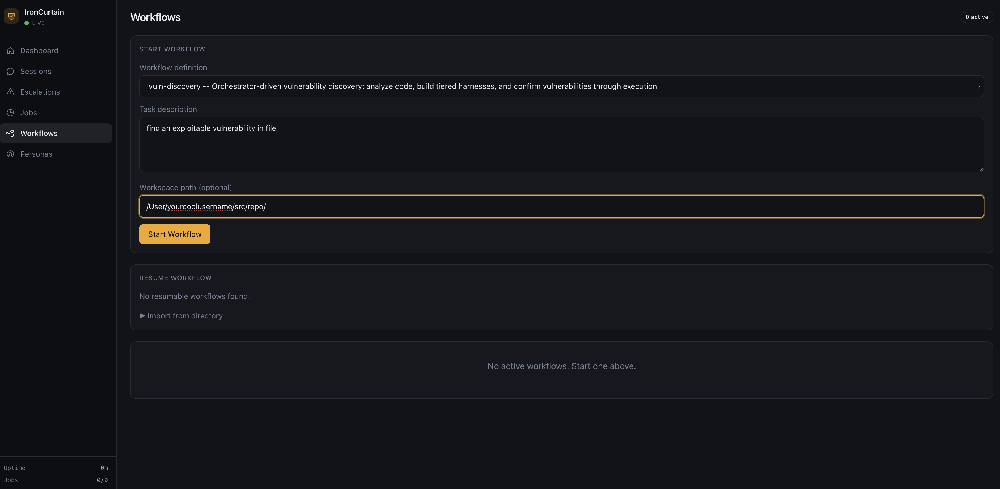

# Vulnerability Discovery Workflow — Onboarding

This guide walks a new user from a fresh checkout to a running `vuln-discovery` workflow in the web UI. The workflow analyzes a body of code you point it at, builds tiered instrumented harnesses, and tries to execute its way to a confirmed vulnerability finding.

## Prerequisites

- **Node.js 22, 23, or 24** (`isolated-vm` requires this; Node 25 segfaults and pre-flight will reject it)
- **Docker** running. The workflow uses Docker Agent Mode with `--network=none`, so Docker is required (not optional).
- **LLM credentials.** Either:
  - `ANTHROPIC_API_KEY` exported in your shell or set in `~/.ironcurtain/config.json`, **or**
  - A logged-in Claude Code install on this machine (`~/.claude/.credentials.json`). IronCurtain auto-detects the OAuth token and prefers it over API keys.

## 1. Clone and build from source

```bash
git clone https://github.com/provos/ironcurtain.git
cd ironcurtain

npm install
npm run build
npm test
```

`npm test` runs the full suite (including the web UI unit tests). Integration tests spawn real MCP server processes and can take ~30s each — give it a few minutes.

## 2. Run setup diagnostics

Before launching anything that depends on Docker, credentials, or compiled policy, run the on-demand diagnostic:

```bash
npx tsx src/cli.ts doctor
```

This verifies your Node.js version, Docker, credentials, compiled policy, and MCP server liveness. Add `--check-api` to also exercise an agent-model API round-trip and an OAuth refresh probe. Each failing or warning check prints a one-line remediation hint — read those before re-running. The exit code is `0` if no check returned `fail` (warnings don't fail the run), so it's safe to wire into CI.

## 3. Smoke-test the agent

For an interactive smoke test from source, use the mux:

```bash
npx tsx src/cli.ts mux
```

For a non-interactive check that is easier to capture in logs, `start` is still available:

```bash
npx tsx src/cli.ts start "say hi"
```

Expected output for the non-interactive check:

```
% tsx src/cli.ts start "say hi"
Mode: docker / claude-code (OAuth)
✔ Session ready

Hi! How can I help you today?

Session: 1 steps · 5s · ~$0.03
```

Notes:

- **`Mode: docker / claude-code (OAuth)`** — confirms Docker is reachable and the auth method was detected. The trailing parenthetical is the auth kind: `(OAuth)` or `(API key)`. Either is fine; both work.
- **`Cannot start IronCurtain. ... Docker is not available`** — the default mode is Docker, so when Docker is unreachable pre-flight hard-stops here rather than silently falling back to builtin. It prints the underlying `docker info` failure (daemon not running, permission denied, `docker` not in PATH, etc.) — fix that before continuing. Builtin mode is not a fallback for vuln-discovery, and it requires an `ANTHROPIC_API_KEY`; if you have only OAuth credentials, pre-flight refuses to start and tells you so directly.
- **First Docker run is slow.** On first execution IronCurtain builds the `ironcurtain-claude-code:latest` image on demand. Subsequent runs reuse it.

## 4. Start the daemon with the web UI

```bash
npx tsx src/cli.ts daemon --web-ui --no-signal
```

Expected output:

```
% tsx src/cli.ts daemon --web-ui --no-signal
Mode: docker / claude-code (OAuth)
  Web UI: http://127.0.0.1:7400?token=8powXSUJEmUjz1CeEhSz7npgrVhzsr5PyuFmR7qmcK0
IronCurtain daemon started.
  Control socket: listening
```

Open the `Web UI:` URL in your browser. The `token=...` query parameter authenticates the session — keep the tab open or copy the URL somewhere safe. The `--no-signal` flag skips the Signal messaging transport, so the web UI is the only control surface.

## 5. Start the vulnerability workflow

In the sidebar, click **Workflows**. You'll see this form:



Fill it in:

- **Workflow definition**: select `vuln-discovery`.
- **Task description**: can be as simple as `"find a vulnerability in libavcodec/h264_slice.c"`. The workflow's agent prompts handle the methodology — you don't need to spell out scope, vulnerability class, or threat model. Add detail if you want to steer the investigation (e.g., `"find a memory corruption bug reachable from a crafted H.264 stream"`), but a one-liner is fine to start.

- **Workspace path**: point this at a checkout of the code under investigation (e.g. `/Users/you/src/ffmpeg`). The workflow reads source from this directory and writes artifacts to `<workspace>/.workflow/`. If you leave it blank, the orchestrator creates a fresh sandbox — usually not what you want for vulnerability work.

Click **Start Workflow**. The workflow appears under **Active workflows** with live state transitions.

## 6. Human review gates

The `vuln-discovery` workflow has four human gates. Each presents the relevant artifacts and accepts three actions:

- **APPROVE** — continue on the happy path.
- **FORCE_REVISION** — loop back with feedback. The feedback text you type is routed verbatim into the next agent's prompt, so write it as if you were briefing the orchestrator: point at the specific thing to re-examine, don't just say "try again."
- **ABORT** — terminate the run.

### Gate 1: `human_escalation` — orchestrator stalled

The orchestrator routes here when it detects a stall: the same state visited 3+ times without progress, contradictory results across rounds, or no clear next direction. The UI shows the journal, the analysis, and any discovery findings.

- **APPROVE** — let the orchestrator continue from where it was. Use this when you want to give it another round despite the stall signal.
- **FORCE_REVISION** — point the orchestrator at a specific direction. Example: `"You're cycling on Tier-1 results for a cross-component bug. Re-route to harness_design at Tier 2 and link in slice_table state across calls."`
- **ABORT** — give up.

### Gate 2: `harness_design_escalation` — design loop hit its cap

Fires when `harness_design_review` rejected the design 3 times in a row. The UI shows the analysis, the latest harness design, the most recent review, and the journal.

- **APPROVE** — accept the design despite the reviewer's objections; the workflow proceeds straight to `harness_build` and the harness loop counters reset so build/validate start fresh.
- **FORCE_REVISION** — route back to the orchestrator with your directive (typically asking for a different tier or a different hypothesis to design against).
- **ABORT** — give up.

### Gate 3: `harness_validate_escalation` — validate loop hit its cap

Fires when `harness_validate` rejected the build 4 times in a row. The UI shows the analysis, the design, the build, the latest validation report, and the journal.

- **APPROVE** — accept the harness despite validation failures; the workflow returns to the orchestrator with the harness loop counters reset, so it can pick the next state (usually `discover`) without immediately re-escalating.
- **FORCE_REVISION** — route back to the orchestrator with your directive (e.g., "the validator is gating on a metric the design never specified — redesign with the libFuzzer `cov:` field named explicitly").
- **ABORT** — give up.

### Gate 4: `report_review` — final report

When the orchestrator decides the investigation is `complete`, the `conclude` agent writes the final report to `.workflow/report/report.md` and this gate fires. The UI shows the report, the discovery findings, the triage report, and the journal.

- **APPROVE** — run ends. The report stands.
- **FORCE_REVISION** — you disagree with a finding, a severity assessment, or a "mitigated" verdict. Example: `"The report calls the len-overflow mitigated, but the 'mitigation' is a comment in the caller, not a runtime check. Re-run discovery at Tier 2 to actually exercise the bounds check."` The workflow routes back to the orchestrator, which will pick an appropriate downstream state (usually re-harnessing at a higher tier).
- **ABORT** — discard and stop.

**Human feedback overrides agent verdicts.** If the report claims something is mitigated and you disagree, the orchestrator is prompted to treat your assessment as authoritative and re-investigate at a higher tier rather than re-running the tier you disputed.

## 7. Where artifacts live

Inside the workspace you pointed at:

```
<workspace>/.workflow/
  journal/journal.md                # investigation journal (orchestrator writes, everyone reads)
  analysis/analysis.md              # structural analysis
  harness_design/design.md          # harness spec
  harness_design_review/review.md   # LLM review of the design
  harness_build/README.md           # build/run instructions
  harness_validate/validation.md
  discoveries/findings.h1.md, ...   # what the researcher found, one file per hypothesis
  triage/triage.h1.md, ...          # independent reproduction + severity, per hypothesis
  report/report.md                  # final report index (+ report.h1.md, ... per hypothesis)
  report_review/review.md           # LLM report review (precedes the report_review human gate, Gate 4)
```

`.workflow/` is auto-added to the workspace's `.gitignore`.

Run-level bookkeeping (audit log, message log, shared Docker bundle) lives separately under `~/.ironcurtain/workflow-runs/<workflowId>/` — see [WORKFLOWS.md](https://github.com/provos/ironcurtain/blob/master/WORKFLOWS.md#workflow-run-layout).

## 8. Resuming an interrupted run

If you close the browser, restart the daemon, or the workflow fails partway through, the **Resume workflow** panel on the Workflows page lists every run that checkpointed. Click to resume. From the CLI:

```bash
npx tsx src/cli.ts workflow resume ~/.ironcurtain/workflow-runs/<workflowId>
```

## 9. Using a non-Anthropic model via LiteLLM

IronCurtain's default models are Anthropic Claude, but you can route LLM traffic through an OpenAI-compatible gateway like [LiteLLM](https://docs.litellm.ai/) to back the agent with OpenRouter, a self-hosted open-weight model, or any other provider. The same configuration works for both Code Mode and Docker Agent Mode (the MITM proxy in Docker Mode forwards upstream to the override after swapping the sentinel key for your real key).

The mechanism is a base-URL override. Set one of:

- `ANTHROPIC_BASE_URL` env var, or `anthropicBaseUrl` in `~/.ironcurtain/config.json` (env wins)
- `OPENAI_BASE_URL` / `openaiBaseUrl`
- `GOOGLE_API_BASE_URL` / `googleBaseUrl`

Point it at your gateway (e.g. `http://localhost:4000`) and make sure the gateway exposes the model IDs IronCurtain asks for — primarily `agentModelId` from `~/.ironcurtain/config.json`, plus any pipeline/persona/workflow overrides. You can also override per run with `--model <id>` on `start` and `mux`.

Caveats worth knowing before you run vuln-discovery on a non-Claude backend:

- Anthropic-native features (prompt caching, thinking blocks, 1M-context, server-side web search) silently degrade. Calls still succeed; the capabilities just disappear.
- Cost caps in `resourceBudget.maxEstimatedCostUsd` bill at the model ID the agent asked for, not the actual backend. If you remap `claude-opus-4-7` to something cheaper, the cost tracker still bills at Opus rates — raise or disable (`null`) the cap.
- Tool-use quality matters a lot here: the workflow makes heavy use of tool calls and weak models will thrash rather than fail cleanly. Smoke-test with a short task before kicking off a full run.

For a full LiteLLM + OpenRouter recipe (proxy install, `config.yaml`, auth wiring, troubleshooting), see [MODEL_ROUTING.md](https://github.com/provos/ironcurtain/blob/master/MODEL_ROUTING.md).

## 10. Troubleshooting

When something goes wrong, `npx tsx src/cli.ts doctor` (see step 2) is usually the fastest way to localize the problem — it runs every check and reports each one independently rather than failing fast.

- **"Docker image not found"** — the auto-build failed. Build manually:
  ```bash
  docker build -t ironcurtain-claude-code:latest -f docker/Dockerfile.claude-code .
  ```
- **`Cannot start IronCurtain. ... Docker is not available` even though Docker is installed** — `docker info` failed. Common causes: daemon not started (most often), your user not in the `docker` group on Linux, or Docker Desktop not running on macOS. Pre-flight prints the `docker info` failure reason inline. `doctor` reports the same failure under the `Docker` row.
- **Workflow stops at `human_escalation` without an obvious reason** — the orchestrator hit a stall pattern (same state 3+ times without progress, contradictory results, or unclear strategy). Open the gate, read the journal, and either `FORCE_REVISION` with a concrete new direction or `ABORT`.
- **Budget exhausted** — a run is capped at `maxRounds: 12` and `maxSessionSeconds: 10800` (3 hours) per the workflow definition. For bigger targets, copy the whole `src/workflow/workflows/vuln-discovery/` directory (it carries co-packaged skills the workflow needs) to `~/.ironcurtain/workflows/vuln-discovery/` and raise the limits in its `workflow.yaml`.
